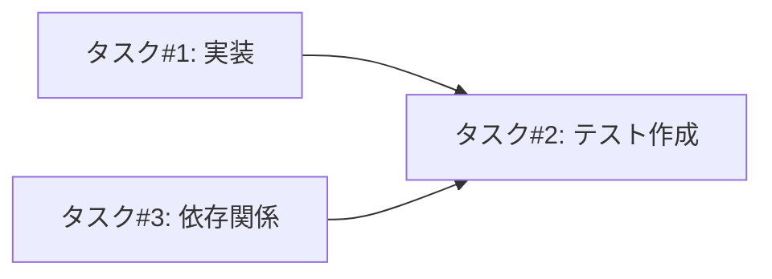
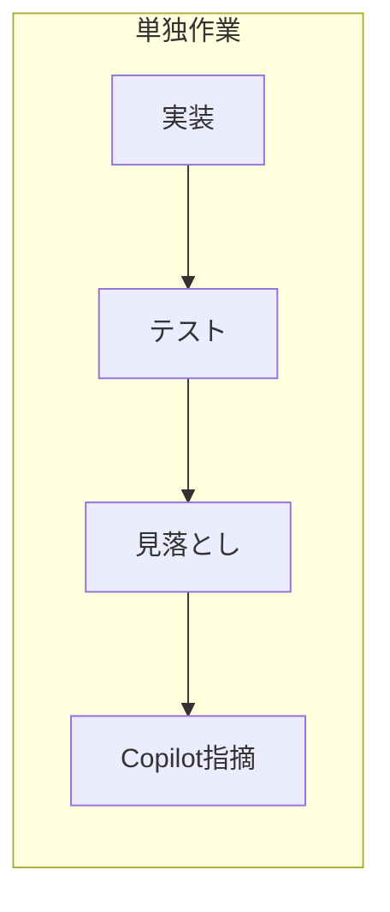
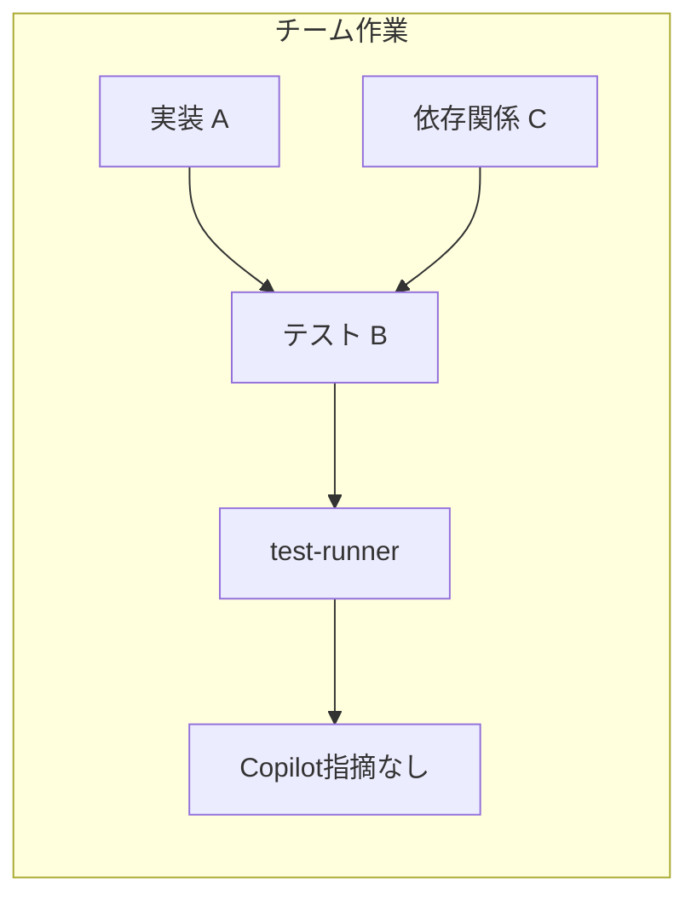

# エージェントチーム開発 — レトロスペクティブ

## 概要

Claude Codeのエージェントチーム機能を活用した開発手法の知見をまとめる。

## 初回適用: Issue #169 エンコーディング問題の修正（PR #172）

### 背景

RAG検索結果がチャット回答に反映されない問題（#169）を調査・修正した。

**根本原因**: Shift_JISエンコーディングのWebページがUTF-8として誤デコードされ、日本語テキストが文字化け状態でChromaDBに保存されていた。

### チーム構成

| 役割 | 担当タスク |
|------|-----------|
| リーダー | 統括・方針決定・PR作成 |
| 実装担当 | `web_crawler.py`のエンコーディング検出実装 |
| テスト担当 | テストコード作成（5件） |
| 依存関係担当 | `pyproject.toml`への依存追加 |

### 結果

- **Copilotレビュー指摘: ゼロ**（従来のPRでは毎回指摘があった）
- 全テスト通過（404 passed）
- ruff / mypy / markdownlint 違反なし

## うまくいったこと

### 1. 役割分離による専門性

- 各エージェントが専門タスクに集中
- 実装者とテスト作成者が別なので、第三者視点でテストが書かれた
- 「自分の実装をテストする」バイアスが排除された

### 2. タスク依存関係の制御



- テストタスクが実装タスクにブロックされる設定
- 実装完了後にテスト作成という流れが保証された
- 並行作業可能なタスク（実装と依存関係追加）は同時進行

### 3. 複数視点によるカバレッジ向上

- 単独作業では見落としがちなポイントが事前にカバーされた
- リーダーが方針を明示することで、実装のブレがなく一貫性のあるコードに

### 4. 最終品質ゲート

- test-runnerで全チェック（pytest/mypy/ruff/markdownlint）を通してからコミット
- チーム作業完了後に品質確認という流れが自然に組み込まれた

## 改善点・ハマったこと

### 1. レビュープロセスの抜け漏れ

**問題**: チーム解散後、レトロ作成時にdoc-reviewerを呼び忘れた。

**原因**: チーム開発では複数視点が入るが、チーム解散後の単独作業では従来通りの見落としが発生。

**対応**: ユーザーからの指摘で気づき、doc-reviewerを実行。

**教訓**: チーム開発でもCLAUDE.mdの手順（特にレビュー工程）は遵守が必要。

### 2. 初回適用のため手探り

**問題**: エージェントチーム機能の初回適用で、最適なタスク分割や依存関係設定が手探りだった。

**対応**: `docs/specs/agent-teams.md` を参照しながら実施。

**教訓**: 新機能適用前に仕様書を熟読することが重要。

## 単独作業との比較





## チーム開発が有効なケース

| シナリオ | 推奨 | 理由 |
|----------|------|------|
| 単純なテスト実行 | サブエージェント | 結果報告のみ |
| 単一ファイルのレビュー | サブエージェント | 焦点を絞ったタスク |
| 複数ファイルにまたがる機能実装 | **チーム** | 並行作業、相互調整が必要 |
| 調査 + 実装 + テストが必要な修正 | **チーム** | 役割分離の効果大 |

## 次に活かすこと

1. **複数ファイルにまたがる機能実装では、積極的にエージェントチームを検討する**

2. **リーダー役が実装方針を事前にチームメンバーに共有する** — ヘルパーメソッド名、処理フローなど

3. **依存関係のないタスクは並列実行を設定し、時間短縮を図る**

4. **実装者とテスト作成者を分けることで、第三者視点のテストを確保する**

5. **チーム解散後もCLAUDE.mdの手順（レビュー工程）は遵守する**

## キャラクター演出ガイドライン追加: Issue #190 / PR #193

### 背景

エージェントチームでキャラクターテーマを使用した際、キャラクターらしさの表現にばらつきがあった。原作の雰囲気を再現するための詳細なガイドラインを追加した。

### 実施内容

1. **キャラクター演出の基本方針**: 原作の表現をふんだんに使うことを明記
2. **リーダーもキャラクターとして振る舞う**: 無個性な「リーダー」役を廃止
3. **リーダーの統率責任**: 品質担保、ペナルティの仕組みを追加
4. **進捗報告ルール**: 作業開始時・中間・問題発見時の報告を義務化
5. **長時間返信がないメンバーへの対応**: リーダーの反応パターンを追加

### 動作確認

2つの異なるテーマでテスト実施:

| テスト | 進捗報告 | 結果 |
|--------|----------|------|
| 1回目（ガイドライン追加前） | 最終報告のみ | 物語感不足、作業状況が把握しづらい |
| 2回目（ガイドライン追加後） | 作業開始・中間・完了 | 物語感向上、リアルタイムで状況把握可能 |

### うまくいったこと

1. **進捗報告の義務化が効果的**: 作業開始時・中間報告により、メンバーが何をしているか把握可能に
2. **キャラクターらしい表現**: 各キャラクターの性格や口癖が自然に反映された
3. **リーダーのキャラクター化**: リーダーもキャラクターとして応答することで一体感が向上

### 改善点

1. **最初のテストでは報告が不足**: ガイドラインで明示する前は中間報告がなかった
2. **具体的な台詞サンプルは著作権リスク**: レビュー指摘を受けて削除し、方針のみ記載する形式に変更

### 次に活かすこと

1. **ガイドラインは「どう表現するか」を言葉で示す**: 具体的な台詞例は避け、Claudeの知識を活用
2. **進捗報告を明示的に指示する**: 「細かく報告して物語感を出す」と伝えると効果的
3. **リーダーは沈黙にも反応する**: メンバーの沈黙を放置せず、キャラクターらしく声をかける

## テーマ履歴管理＋物語構造ルール追加: Issue #198 / PR #200

### 背景

「チームで開発して」でランダム選択する際、特定のテーマが頻出しやすく、多様性が損なわれていた。また、チーム作業中の物語演出が「ただの作業報告」になりがちだった。

### 実施内容

1. **テーマ履歴管理機能**: `~/.claude/team-theme-history.json` に使用履歴を保存し、直近10件との重複を避ける
2. **物語構造の適用ルール**: 課題を「敵」「ライバル」として擬人化し、倒すストーリーとして進める
3. **リーダーによる物語オープニング**: チーム開始時に敵を命名・紹介する手順を追加
4. **外部成果物への物語演出禁止**: コミット・PR・Issueにキャラクター名を含めないルール
5. **レビュー担当役割の必須ルール**: チームに必ず1名以上のレビュー担当を含める

### チーム構成

| 役割 | 担当タスク |
|------|-----------|
| リーダー | 統括・コミット・PR対応 |
| 仕様修正担当 | フィールド表修正、ルール追加 |
| レビュー担当 | doc-reviewer、markdownlint実行 |

### うまくいったこと

1. **物語構造の導入**: レビュー指摘を「敵スタンド使い」として擬人化することで、作業に物語感が生まれた
   - Copilot指摘 → 敵「コピロット」
   - 管理者指摘 → 敵「レビュー・ルール」
   - 仕様不備 → 敵「ルール・ブレイカー」

2. **リアルタイムの仕様改善**: 作業中にユーザーから「物語が足りない」という指摘を受け、即座に仕様を追加・改善できた

3. **レビュー担当の分離**: レビュー担当が専任として機能し、仕様修正担当の成果物を第三者視点で確認

### 改善点・ハマったこと

1. **外部成果物への演出漏れ**
   - **問題**: PRコメントにキャラクター名を含むチーム名・メンバー名を記載してしまった
   - **原因**: 物語の熱量がそのまま外部出力に流れた
   - **対応**: 「外部成果物への物語演出禁止」ルールを仕様に追加

2. **物語オープニングの欠如**
   - **問題**: チーム開始時に「敵」を紹介するターンがなく、いきなり作業に入った
   - **対応**: 「リーダーによる物語オープニング」手順を追加

3. **意識的な切り替えの必要性**
   - **問題**: キャラクターを演じながら外部出力を書く際、無意識にキャラクター要素が混入
   - **対応**: `git commit`や`gh pr`実行時に「ここから外部出力」と意識するトリガーを設定

### 次に活かすこと

1. **チーム開始時に必ず「物語オープニング」を行う**: 敵の命名・能力説明・作戦宣言

2. **外部出力の前に一時停止**: コミット・PR・Issueを書く前にキャラクター要素がないか確認

3. **課題を「敵」として擬人化**: ジャンルに応じた物語構造（バトル系なら敵、スポーツ系ならライバル）を適用

4. **レビュー担当を必ず1名以上配置**: チーム構成時に品質担保の役割を明確化

5. **仕様は運用しながら改善**: 問題が発生したら即座にルール化し、仕様書に刻む

## ストーリーテラー役の追加: Issue #220 / PR #221

### 背景

エージェントチームでの開発において以下の問題が発生していた:

1. **リーダーの負荷集中**: メンバーからの報告待ち、進捗把握、ユーザー報告で手一杯
2. **見落としの発生**: ルール違反（キャラ名の成果物混入）、ドキュメント参照漏れ、履歴更新忘れ
3. **品質担当の役割限界**: code-reviewer/doc-reviewer/test-runner は成果物の品質チェックに特化しており、プロセス全体の監視は範囲外

当初は「メタレビュアー」という監視役を提案したが、チームで議論した結果「ストーリーテラー（語り部）」として再設計した。

### 議論プロセス

チーム構成で検討:

| 役割 | 視点 | 主な意見 |
|------|------|---------|
| リーダー | 論点整理 | 両者の意見を統合 |
| メンバーA | 科学的・分析的 | 心理学的な観点で「指示」と「想起」の違いを分析 |
| メンバーB | 実務者・現場感覚 | 複雑化への懸念、既存品質担当の拡張を優先すべきと主張 |

**転換点**: ユーザーから「ストーリーテラーとして物語を語らせ、想起のきっかけにする」というアイデアが出された。これにより:

- 「指示」→「気づき」への転換で心理的抵抗を解消
- キャラクターテーマとの親和性が向上
- 「報告」と「指示」の境界問題を解消（物語は指示にならない）

### 実施内容

1. **役割定義**: プロセス全体を見守り、物語として状況を語る
2. **介入パターン**: 問題レベルに応じてテンションを変える
   - Medium: 静かな伏線（「一方その頃...」）
   - High: 不穏な予兆
   - Critical: 大事件発生＋具体的対象を明示
3. **テーマ別バリエーション**: ナレーター/吟遊詩人/実況者など
4. **受け入れ条件追加**: AC6, AC7

### うまくいったこと

1. **チーム議論による視点の多様化**: 賛成派（分析的視点）と慎重派（実務的視点）の対立から、より良い案が生まれた

2. **ユーザーからのアイデア取り込み**: 「監視」→「見守り」への転換は、チーム内議論だけでは出なかった発想

3. **Critical対応の演出**: 「物語を中断する」のではなく「大事件として演出する」という発想で、世界観を壊さず緊急性を伝えられる設計に

### 次に活かすこと

1. **「監視」より「見守り」**: 指摘ではなく気づきを促すアプローチが効果的

2. **問題の深刻度をテンションで表現**: 別途ルールを覚えるより、語りの熱量で直感的に伝わる

3. **Critical時は具体的対象を明示**: 曖昧な語りでは対応が遅れる。「何が」「どう問題か」を含める

4. **議論はチームで、転換点はユーザーから**: チーム内で煮詰まっても、ユーザーの一言で視点が変わることがある

## SendMessage の content が届かない問題: Issue #224

### 背景

エージェントチームでメンバーからリーダーへ SendMessage を送っても、`idle_notification` の summary のみが届き、DM本文（content）が届かない問題が発生していた。

### 調査プロセス

1. **問題の再現**: チームを組んで調査したところ、問題が再現された
2. **メールボックス確認**: `~/.claude/teams/{team-name}/inboxes/` 配下を確認したところ、プロンプトで指定した recipient（例: `my-leader`）向けの inbox にメッセージが保存されていた。
   この時点では `read: false` のままであることが原因だと誤認していたが、後の調査で、リーダーが実際に監視しているのは `team-lead` 向けの inbox であり、`read` フラグ自体は根本原因ではなかったことが判明
3. **GitHub Issues 調査**: 関連する問題（#24108, #24307）を発見
4. **当初の回避策**: Issue #24307 のコメントで `mode: "bypassPermissions"` の使用が成功事例として報告されていたため、これを採用

### 当初の結論（誤り）

~~Task ツールでメンバーをスポーンする際に `mode: "bypassPermissions"` を設定しないと、SendMessage の content がリーダーに配信されない。~~

### 真の根本原因（2026-02-11 判明）

**recipient の指定ミス**が原因だった。`mode: "bypassPermissions"` は無関係。

- プロンプトで「リーダー（my-leader）に報告して」と指示 → メンバーは `recipient: "my-leader"` で送信
- メッセージは `my-leader.json` に保存される
- しかし、リーダーシステムは `team-lead.json` を読む
- 結果、DM本文が届かない（`idle_notification` は別経路で `team-lead.json` に直接書き込まれるため届く）

当初の調査では `mode: "bypassPermissions"` と `recipient: "team-lead"` を同時に変更したため、どちらが原因か切り分けられていなかった。

### 検証結果

| mode | recipient | 結果 |
|------|-----------|------|
| なし | `"my-leader"`（任意の名前） | ❌ 届かない |
| `bypassPermissions` | `"my-leader"` | ❌ 届かない |
| なし | `"team-lead"` | ✅ **届く** |
| `bypassPermissions` | `"team-lead"` | ✅ 届く |

**結論**: `mode: "bypassPermissions"` は不要。**recipient の指定だけが原因**。

### 正しい対応

プロンプトでリーダーへの送信を指示する際は、**`recipient: "team-lead"`** を明示する。

```
❌ NG: 「リーダー（my-leader）に報告してください。recipient: "my-leader" で送信」
✅ OK: 「リーダーに報告してください。recipient: "team-lead" で送信」
```

### 次に活かすこと

1. **プロンプトでリーダーへの送信を指示する際は `recipient: "team-lead"` を明示する**

2. **問題発生時はメールボックスファイルを直接確認する**: `~/.claude/teams/{team-name}/inboxes/` 配下のJSONファイルで、メッセージが保存されているか、**どのファイルに保存されているか**を確認

3. **複数の変数を同時に変更しない**: 原因切り分けのため、一度に1つの変数だけ変更して検証する

4. **anthropics/claude-code の Issues を調査する**: 同様の問題が報告されている可能性がある

## 議論タスクでの成功例: Issue #238 仕様書リファクタリング（2026-02-11）

### 背景

agent-teams.md が258行に膨張し、複雑化していた。3つの修正案（案A: 最小構成、案B: プロンプト例中心、案C: 構造維持・削減のみ）から最適な方針をチームで議論した。

### チーム構成

| 役割 | 担当視点 | 主な貢献 |
|------|----------|---------|
| リーダー | 議論統括 | 論点整理、各メンバーの意見を引き出す |
| メンバーA | 現場視点 | 実際にプロンプトを書く立場からの評価 |
| メンバーB | 構造的・長期的視点 | 認知負荷、DRY原則、仕様書の本来の役割 |
| ストーリーテラー | 語り部 | 議論の盛り上げ、各案のポイント整理 |

### 議論の結果

**採用案**: 案A改良版（2ファイル構成）

- **agent-teams.md（仕様書）**: 96行に圧縮（ACで検証可能な内容のみ）
- **agent-teams-operations.md（運用詳細）**: 新規作成（手順、プロンプトテンプレート、教訓）
- **CLAUDE.md**: 重複解消、運用詳細への参照に置き換え

### うまくいったこと

#### 1. プロンプト構造が効果的だった

以下の構造がスムーズな議論を生んだ:

```
1. チーム構成（他メンバーの存在と役割）
2. キャラクター設定（一人称、性格、口調）
3. 担当視点（何の立場で意見を述べるか）
4. 議論対象（選択肢の構造化された説明）
5. 検討ポイント（具体的な問いかけ）
6. 回答形式（結論→理由→具体案、分量目安）
7. 報告ルール（recipient、content の注意）
```

#### 2. 視点の明確な境界が重複を防いだ

- 「現場視点」と「構造的視点」で棲み分け
- 同じ結論でも異なる角度からの検証になった

#### 3. 具体的な問いかけが議論を誘導した

- 「どの構成が漏れにくいか？」
- 「複数ファイルを参照するのは負担か？」
- 「仕様書の本来の役割とは？」

→ 漠然と「意見を」ではなく、考える軸が示されていた

#### 4. 分量の目安が適切だった

- 「2-4回のメッセージ」という指定
- 長すぎず短すぎず、議論が散らからなかった

#### 5. ストーリーテラーがリーダーから通知を受けて機能した

- 「チーム始動した」「議論が収束した」等の通知
- 通知を受けて語りを入れるタイミングが明確に

### 改善点として特定されたこと

#### 1. 他メンバーの存在を最初から知りたかった

メンバー全員が指摘。プロンプトに「チーム構成」セクションを追加することで解決。

#### 2. 議論の目的・ゴールが暗黙的だった

「採用案を1つに絞る」等の目標が明示されていると収束しやすい。

#### 3. 背景情報へのリンクがあると良い

Issue番号、関連ファイルパスを記載すると、メンバーが自分で調べられる。

### 作成した成果物: 議論タスク用プロンプトテンプレート

今回の議論を通じて、議論タスク向けのプロンプトテンプレートを作成した。
詳細は [agent-teams-operations.md](../specs/agent-teams-operations.md#議論タスク用プロンプトテンプレート) を参照。

### 次に活かすこと

1. **議論タスクでは実装タスクと異なるプロンプト構造を使う**: 選択肢、検討ポイント、回答形式を明示

2. **チーム構成を最初に共有する**: 他メンバーの存在と担当視点を知らせることで、意見の棲み分けが可能に

3. **具体的な問いかけを用意する**: 漠然と「意見を」ではなく、評価軸を示す

4. **分量の目安を指定する**: 「2-4回のメッセージ」等で議論が散らかることを防ぐ

5. **ストーリーテラーには状況を通知する**: 自律的な監視はできないため、リーダーが節目で通知

## 現状の機能限界: 動的なチーム再編成（2026-02-11）

### 発見の経緯

Issue #238 の議論タスクから実装タスクへ移行した際、チーム再編成（品質担当の追加等）が行われなかった。ユーザーからの指摘で議論した結果、これは Agent Teams の現状の機能限界であることが判明。

### 限界の内容

1. **静的なチーム構成が前提**: Agent Teams は最初に組んだメンバーで最適に動くことを想定
2. **フェーズ変化の検知が困難**: ストーリーテラーは能動的なタスク監視ができず、リーダーからの通知に依存
3. **再編成のオーバーヘッド**: 議論と実装が交互に来る場合、毎回メンバーを追加/削除するとコストが大きい

### 現実的な運用

- **初期構成の最適化**: タスク全体を見渡し、必要な役割を最初から含める
- **軽微な作業はリーダー単独で**: 議論後の小規模な実装はリーダーが直接行う
- **大きなフェーズ変化時のみ再編成**: 明確に性質が変わる場合（例: 調査→大規模実装）に限定

### 将来の改善可能性

Claude Code の Agent Teams 機能がアップデートされ、動的な再編成がサポートされる可能性はある。現時点では上記の運用で対応する。

## 参考

- エージェントチーム仕様: [docs/specs/agent-teams.md](../specs/agent-teams.md)
- エージェントチーム運用詳細: [docs/specs/agent-teams-operations.md](../specs/agent-teams-operations.md)
- 関連PR: #172（エンコーディング自動検出修正）、#193（キャラクター演出ガイドライン）、#200（テーマ履歴管理＋物語構造ルール）、#221（ストーリーテラー役追加）
- 関連Issue: #169（RAG検索結果がチャット回答に反映されない）、#190（キャラクター演出）、#198（チームビルディングの偏りを防ぐ）、#220（メタレビュアー役の検討）、#224（SendMessage の content が届かない問題）、#238（agent-teams.md の簡素化）
