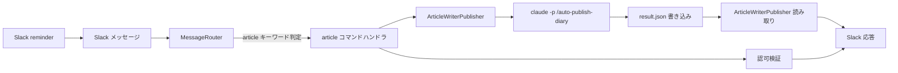

# 記事自動投稿（article-writer 連携）

## 概要

Slack コマンドにより、ホスト PC 上の article-writer リポジトリで `claude -p '/auto-publish-diary'` を起動し、日記記事の生成 → Hatena 下書き登録 → PR 作成 → 即マージ → worktree クリーンアップまでを無人実行する機能。
実行結果（成功時の下書き URL・PR URL、失敗時の残置 worktree パス）を Slack に通知する。

主用途は Slack reminder からの定時自動投稿。手動運用負荷を下げ、日記投稿の安定継続を実現する。

## 背景

- article-writer 側に `/auto-publish-diary` スキルが新設された（article-writer PR #70 / Issue #68）。記事生成 → Hatena 下書き登録 → PR 作成 → 即マージ → worktree クリーンアップを一括する無人実行ワンショットスキル
- スキル本体は単独で動作するが、毎日定時に無人実行するには起動トリガーが必要
- Slack reminder は標準機能でメッセージ定時投稿が可能。reminder からのトリガーを受け取り `claude -p` をホスト PC 上で起動する受信側が ai-assistant 側に未実装

## 制約

- **二重 allowlist 方式**: 認可ユーザー allowlist の通過とリポジトリパス設定の存在の両方を確認した上で起動する。任意ユーザーでの起動は拒否する。Slack 経由で任意プロセスを起動可能になることを防ぐため
- **既存 Remote Control allowlist を共用**: 認可ユーザーは Remote Control 機能の `REMOTE_CONTROL_ALLOWED_USERS` を流用する。本機能と Remote Control 起動の許可ユーザーが運用上一致しており、env を増やさないため
- **起動コマンドはリスト引数で渡す**: `subprocess` の `shell=False` でリスト引数を渡し、コマンドインジェクションを防止する
- **スキル名はハードコード**: 起動対象のスキルは `/auto-publish-diary` 固定。外部入力（Slack コマンド本文）からスキル名を組み立てない
- **`--dangerously-skip-permissions` モードで起動する**: `claude -p` は git ネットワーク操作（`git fetch` / `git pull` / `git push`）・`gh pr create` / `gh pr merge` の permission をデフォルトで拒否する。
  `/auto-publish-diary` はこれらを多用するため `--dangerously-skip-permissions` で全許可する。緩和策として以下の 4 段防御で対処する:
  - allowlist による実行ユーザー制限
  - `cwd` を `ARTICLE_WRITER_REPO_PATH` に固定
  - スキル名（`/auto-publish-diary`）の固定（外部入力からスキル名を組み立てない）
  - 設定パスの `Path.is_absolute()` 検証による相対パス指定の排除
- **対象リポジトリのパスは絶対パスのみ許可**: `ARTICLE_WRITER_REPO_PATH` は絶対パスで指定する。意図しないディレクトリでの起動を防ぐため
- **同時実行制御は提供しない**: 多重起動の防止は本機能のスコープ外。Slack reminder の運用では基本的に 1 日 1 回のみ起動される前提
- **リトライしない**: 子プロセス起動の失敗・タイムアウト・レスポンスファイル解析失敗いずれもリトライせず、即座にエラーを Slack に返す。再実行は運用判断で手動再投入する
- **操作全体のタイムアウトは設定値で制御する**: `article_publish_timeout` は設定値（種別: 設定値、許容範囲は pydantic Field が SSoT）。タイムアウト経過時は子プロセスを kill する
- **失敗時の worktree 残置の自動掃除は提供しない**: `/auto-publish-diary` は失敗時に worktree を残置する設計（state 保持のため）。残置 worktree の定期掃除は本機能のスコープ外で、運用上の手動掃除でカバーする
- **トリガー（Slack reminder の登録）は本機能のスコープ外**: Slack 標準機能で reminder を登録する。コード変更なし
- **対象スキルの SSoT は article-writer 側**: `/auto-publish-diary` の出力契約（レスポンスファイルのフィールド構成・終了コード・書き込み先パス）は article-writer 側の仕様に従う。本機能は出力契約のうち本機能が依存するフィールドのみを参照する
- **結果はレスポンスファイルから取得する**: `claude -p --output-format text` は Claude の最終応答テキストのみを返す（subprocess 内の `echo` 出力を中継しない）ため、stdout からの構造化データ取得は不定。
  `/auto-publish-diary` は親リポ直下の `.tmp/auto-publish-diary/result.json` に成否情報を書き出す契約とし、本機能はこのファイルを読む。
  stdout はエラー時のログ表示用にのみ使用する

## 操作一覧

| 操作 | トリガー | 概要 |
|---|---|---|
| Hatena への日記自動投稿 | `article write-hatena` キーワード | article-writer 側の `/auto-publish-diary` スキルを起動し、結果を Slack に通知する |

- メンション付き・自動返信チャンネルの両方で動作する
- Slack reminder からの定時投稿も同じトリガーキーワードで動作する（reminder プレフィックスは既存ルーターが除去する）

## 各操作の仕様

### Hatena への日記自動投稿

**トリガー**: メッセージが `article write-hatena` の形式（先頭が `article`、サブコマンドが `write-hatena`）

サブコマンド名は小文字に正規化してから比較する（既存の `feed` / `rag` / `rc` コマンドと同パターン）。

**振る舞い**:

1. 認可ユーザー allowlist（`REMOTE_CONTROL_ALLOWED_USERS`）にメッセージ送信者の Slack `user_id` が含まれるか検証する。含まれない場合は権限エラーを返して終了する
2. `ARTICLE_WRITER_REPO_PATH` が設定されているか検証する。空または未設定の場合は機能無効メッセージを返して終了する
3. Slack に「投稿処理を開始します」メッセージを返す（実行時間が長いため処理開始を明示する）
4. 設定された絶対パスが実在ディレクトリであることを検証する。存在しない場合は構成エラーを Slack に返して終了する
5. `claude` 実行ファイルが PATH 上で解決できることを検証する。解決できない場合は前提エラーを Slack に返して終了する
6. `claude -p '/auto-publish-diary' --dangerously-skip-permissions --output-format text` を `cwd=ARTICLE_WRITER_REPO_PATH` で起動する。stdout / stderr を捕捉し、終了コードを取得する
7. プロセスがタイムアウト時間内に終了しない場合は kill し、タイムアウトエラーを Slack に返す
8. 親リポ直下のレスポンスファイル `<ARTICLE_WRITER_REPO_PATH>/.tmp/auto-publish-diary/result.json` を読み込み、JSON としてパースする。ファイル不在・読み取り失敗・JSON 解析失敗・dict 以外の値の場合は実行結果解析エラーを Slack に返す
9. 終了コードが 0 + JSON 解析成功の場合は結果フィールド（`status` / `article_path` / `draft_url` / `pr_url` / `worktree_removed` / `worktree_path`）を Slack 通知に整形する
10. 終了コードが非 0 + JSON 解析成功の場合は失敗結果として Slack に返す。失敗時の JSON に `worktree_path` が含まれる場合は併せて通知する

ステップ 4・5 が処理開始メッセージの後にあるのは、ホスト固有の前提（ディレクトリ実在・`claude` 実行ファイル PATH 解決）の検証を `ArticleWriterPublisher` サービス層に集約し、router 側を薄く保つ設計上の判断による。構成エラー時は「開始」「失敗」の 2 メッセージがユーザーに届くが、処理は正しく中断される。

**出力**:

成功時（`status="ok"` / `worktree_removed=true`）:

```
✅ 日記の自動投稿に成功しました
記事: articles/hatena/2026-05-20-diary.md
下書き: https://example.hatenablog.com/entry/2026/05/20/152523
PR: https://github.com/becky3/article-writer/pull/71
```

成功時（`status="ok"` / `worktree_removed=false`、cleanup のみ失敗）:

```
✅ 日記の自動投稿に成功しました（worktree 削除のみ失敗）
記事: articles/hatena/2026-05-20-diary.md
下書き: https://example.hatenablog.com/entry/2026/05/20/152523
PR: https://github.com/becky3/article-writer/pull/71
残置 worktree: article-writer-wt-auto-20260520
```

権限拒否時:

```
❌ このコマンドを実行する権限がありません
```

機能無効時（`ARTICLE_WRITER_REPO_PATH` 未設定）:

```
記事自動投稿機能は現在無効です。管理者に設定を依頼してください。
```

タイムアウト時:

```
⌛ 記事の自動投稿がタイムアウトしました（{N}分）。article-writer 側の worktree が残置されている可能性があります。
```

失敗時（終了コード非 0、レスポンスファイル解析成功）:

```
❌ 日記の自動投稿に失敗しました
exit code: {終了コード}
失敗 Phase: {failed_phase}
理由: {error フィールド}
残置 worktree: {worktree_path}
```

実行結果の解析失敗時（レスポンスファイル不在・JSON 解析失敗等）:

```
❌ 日記の自動投稿に失敗しました（実行結果の解析に失敗）
理由: {失敗理由（ファイル不在 / 読み取り失敗 / JSON 解析失敗 / 型不一致）}
exit code: {終了コード}
stdout 末尾: {直近の数行}
```

公開チャンネルでの実行を想定し、Slack 返信には絶対パス全文・シークレット値を含めない。`worktree_path` は article-writer リポジトリ内の相対パス前提で通知し、絶対パスの場合は最後のセグメントのみ表示する。詳細な絶対パスはサーバーログにのみ出力する。

### サブコマンドの拡張余地

`article write-zenn` 等の追加は別 Issue で扱う。本機能のスコープは `article write-hatena` のみ。

## 設定

設定値は3層分離方針（[`config-management.md`](../infrastructure/config-management.md)）に従う。

| 項目名 | 層 | 設計意図 |
|---|---|---|
| `ARTICLE_WRITER_REPO_PATH` | 環境依存値 | article-writer リポジトリの絶対パス。空または未設定の場合は本機能は無効化される。絶対パス必須（意図しないディレクトリでの起動防止） |
| `REMOTE_CONTROL_ALLOWED_USERS` | 環境依存値 | 本機能でも認可ユーザー allowlist として流用する（Remote Control 機能と共用）。詳細は [`remote-control-launch.md`](remote-control-launch.md) の同名項目を参照 |
| `article_publish_timeout` | 共通設定値 | `claude -p` 起動のタイムアウト秒数。`/auto-publish-diary` の実機 QA 実測 ~13 分を踏まえて余裕を持たせる |

具体値の制約は pydantic Field 定義（`src/config/settings.py`）が SSoT。仕様書では設計意図のみを記述する。

## コンポーネント構成



| コンポーネント | 役割 |
|---|---|
| MessageRouter | `article` キーワードで本ハンドラへルーティング |
| article コマンドハンドラ | サブコマンド `write-hatena` の引数解析・エラー応答整形 |
| 認可検証 | `REMOTE_CONTROL_ALLOWED_USERS` allowlist チェック |
| ArticleWriterPublisher | `claude -p '/auto-publish-diary'` の subprocess 起動・親リポ直下 `.tmp/auto-publish-diary/result.json` の読み取り・結果整形 |
| result.json | スキル側が親リポ直下に書き出すレスポンスファイル。SSoT は article-writer 側スキル仕様 |

## エッジケース

| ケース | 振る舞い |
|---|---|
| `ARTICLE_WRITER_REPO_PATH` が空または未設定 | 本機能は無効。「機能は現在無効です」とのメッセージを返す（fail-closed） |
| `REMOTE_CONTROL_ALLOWED_USERS` が空 | 認可ユーザーがいない状態のため、全ユーザーからのコマンドが権限エラーで拒否される |
| 同時実行（実行中にもう一度コマンドが送信される） | 制約セクション「同時実行制御は提供しない」を参照 |
| `claude` プロセスが即時終了（result.json 未生成） | 実行結果解析エラーを Slack に返す（exit code と stdout 末尾を含む） |
| result.json が読み取れない / JSON として不正 / dict でない | 実行結果解析エラーを Slack に返す。`worktree_path` は取得できないため、ユーザーはサーバーログを確認する |
| タイムアウト | 子プロセスを kill し、タイムアウトエラーを返す。worktree が残置されている可能性を明示する |

## 関連ドキュメント

- [remote-control-launch](remote-control-launch.md): allowlist 共用元・既存 subprocess パターンの参考
- [cli-adapter](cli-adapter.md): メッセージルーティング基盤
- [auto-reply](auto-reply.md): 自動返信チャンネルでのコマンド動作
- [config-management](../infrastructure/config-management.md): 設定の3層分離方針
- article-writer リポジトリ `/auto-publish-diary` スキル: [PR #70](https://github.com/becky3/article-writer/pull/70) / [Issue #68](https://github.com/becky3/article-writer/issues/68)（スキル本体の出力契約・実行フローはこちらが SSoT）
- article-writer [Issue #75](https://github.com/becky3/article-writer/issues/75): 出力契約を stdout JSON からレスポンスファイル方式に変更する Issue（本機能の前提）
