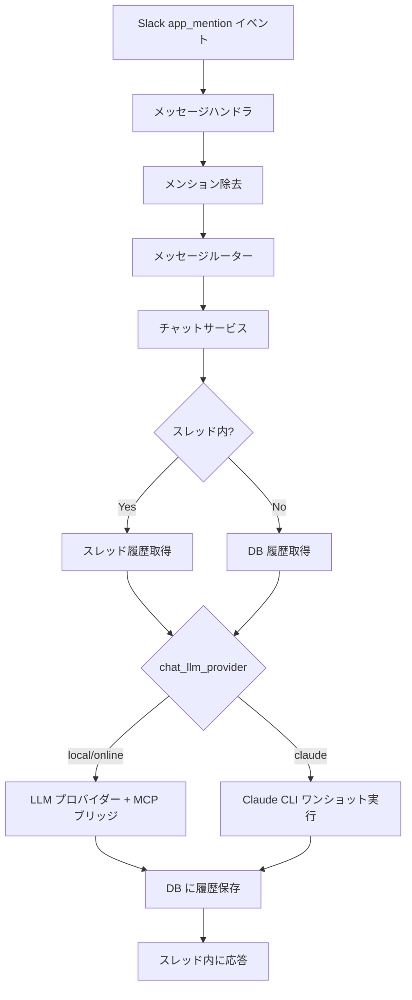

# チャット応答

## 概要

Slack でボットにメンションされた際に、性格設定に基づいてスレッド内で会話応答を行う機能。

会話履歴を保持し、文脈を踏まえた応答を返す。MCP ツール連携・RAG ナレッジ検索の詳細は別仕様で定義する。

## 背景

- Slack 上で自然な会話体験を提供するため
- 性格設定により、プロジェクトに適した応答トーンを実現する
- 会話の文脈を保持し、継続的なやり取りを可能にする

## 制約

- メンション部分（`<@BOT_ID>`）は LLM に送信する前に除去する。メンション文字列がそのまま LLM に渡ると応答品質が低下するため
- 会話履歴（ユーザーメッセージ・アシスタント応答）は DB に保存する。スレッド履歴取得が失敗した場合のフォールバックデータとして機能するため
- LLM プロバイダーは `chat_llm_provider` 設定で切り替え可能（`local` / `online` / `claude`）
- `claude` モードではプロンプトを stdin 経由で渡す。コマンドライン引数の文字数制限を回避するため

## 操作一覧

| 操作 | トリガー | 概要 |
|------|---------|------|
| チャット応答 | Slack `app_mention` イベント | メンションに対してスレッド内で会話応答を返す |

## 各操作の仕様

### チャット応答

**トリガー**: Slack `app_mention` イベント（ボットへのメンション）

**振る舞い**:

1. メンション部分を除去してユーザーの入力テキストを抽出する
2. フォーマット指示と性格設定からシステムプロンプトを構成する（フォーマット指示の詳細は `slack-formatting.md` を参照）
3. 会話履歴を取得する（スレッド内: Slack API → DB フォールバック / スレッド外: DB。詳細は `thread-support.md` を参照）
4. `chat_llm_provider` の値に応じて応答を生成する（後述「LLM モード」参照）
5. ユーザーメッセージとアシスタント応答を DB に保存する

**出力**: スレッド内にテキストメッセージで応答

#### LLM モード

`chat_llm_provider` の設定値によって、応答生成の方式が切り替わる。

##### `local` / `online` モード（従来方式）

LLM プロバイダー API を直接呼び出す。MCP ツール連携は ai-assistant の MCP ブリッジ経由で行う。

1. MCP が有効な場合、auto_context ツールを実行してコンテキストを注入する
2. 会話履歴 + ツール定義を LLM に送信する
3. LLM がツール呼び出しを要求した場合、MCP ブリッジ経由で実行し結果を返す（ツールループ）
4. テキスト応答が得られるまで繰り返す

詳細は [MCP 統合](../infrastructure/mcp-integration.md) を参照。

##### `claude` モード

Claude CLI（`claude -p`）のワンショット実行で応答を生成する。MCP ツール連携は Claude CLI が直接行うため、ai-assistant の MCP ブリッジ・ツールループは使用しない。

1. 会話履歴とユーザーメッセージを1つのプロンプトテキストに整形する
2. Claude CLI を subprocess で起動し、プロンプトを stdin 経由で渡す
   - `--system-prompt`: フォーマット指示 + 性格設定
   - `--allowedTools`: 許可する MCP ツールパターン（`claude_allowed_tools` 設定値）。`claude_allowed_tools` が空文字列の場合はフラグ自体を省略する
   - `--output-format text`: テキスト出力
3. stdout から応答テキストを取得する

MCP ツールの発見・呼び出し・ツールループは全て Claude CLI が内部で処理する。`claude_allowed_tools` が空文字列の場合は MCP ツールを使用せず、テキスト応答のみを生成する。rag-knowledge 側で MCP ツールが追加された場合、ai-assistant 側の変更は不要。

## エッジケース

| ケース | 振る舞い |
|--------|---------|
| メンション除去後にテキストが空 | 応答を行わない（無視する） |
| LLM API 呼び出し失敗 | ユーザーにエラーメッセージを返す |
| MCP ツール呼び出しタイムアウト | （local/online）エラー結果をツールループに戻し、テキスト応答を生成する |
| ツール呼び出しループ上限到達 | （local/online）現在の情報での回答を強制的に要求する |
| Slack API によるスレッド履歴取得失敗 | DB 履歴にフォールバックする（`thread-support.md` 参照） |
| Claude CLI プロセスエラー | ユーザーにエラーメッセージを返す（exit code・stderr をログ出力） |
| Claude CLI タイムアウト | プロセスを終了し、ユーザーにタイムアウトエラーを返す |
| Claude CLI 未インストール | 起動時にバージョンチェックし、未インストール時はエラーメッセージを出力する |

## コンポーネント構成

| コンポーネント | 役割 |
|--------------|------|
| メッセージハンドラ | Slack イベントを受信し、メンション除去後にメッセージルーターに委譲 |
| メッセージルーター | キーワードルーティングに基づき適切なサービスに委譲 |
| チャットサービス | 履歴取得・モード分岐・DB 保存のオーケストレーション |
| LLM プロバイダー | （local/online）応答テキストを生成 |
| Claude CLI | （claude）`claude -p` ワンショット実行で応答テキストを生成。MCP ツール連携を内包 |

## 関連ドキュメント

- [スレッド対応](thread-support.md) — スレッド履歴取得・フォールバック
- [MCP 統合](../infrastructure/mcp-integration.md) — ツール呼び出しループ・自動コンテキスト注入
- [特定チャンネル自動返信](auto-reply.md) — 自動返信チャンネルとの統合
- [Slack mrkdwn 形式対応](slack-formatting.md) — フォーマット指示の構成・適用
- [RAG ナレッジ](../infrastructure/rag-knowledge.md) — RAG 基盤（外部リポジトリに移行済み）
