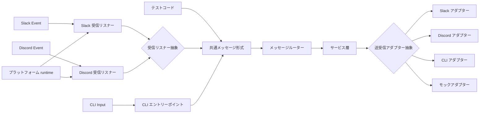

# CLI アダプター

## 概要

メッセージングを抽象化し、Slack 以外のインターフェース（CLI、Discord、テスト）から同一のコードパスで動作できるようにする機能。

本仕様はメッセージングの抽象化層と CLI モードの振る舞いを定義する。各キーワードコマンドの詳細は個別の仕様書を参照。Discord 固有のセットアップ手順は [Discord セットアップ](../infrastructure/discord-setup.md) を参照。

## 背景

- Slack 接続なしでボットの動作確認を行う手段がなかった
- CLI からメッセージを入力して同一のロジックで動作確認したい
- メッセージング層を疎結合にし、テストの容易性とプラットフォーム拡張性を確保する
- 同一のサービス層・メッセージルーターを Slack / Discord 双方で再利用し、プラットフォーム追加時の重複実装を排除する

## 制約

- CLI モードと Slack モードで共通のメッセージルーター・サービス層を通ること。
  異なるのは入口（接続・イベント正規化を担う受信リスナー / stdin）と出口（送信アダプター）のみ
- 受信側・送信側ともにプラットフォーム抽象（受信リスナー / 送信アダプター）に閉じる。メッセージルーターはプラットフォーム非依存とし、Slack 固有のクライアント・トークンを保持しない
- フィード配信（deliver / collect / test）も送信アダプターの配信プリミティブ経由で行う。これにより CLI でも stdout への出力として動作する（プラットフォーム固有のリッチ表示は各アダプターに閉じる）
- 受信ファイルの取得（CSV インポート等）は送信アダプターの `read_file` 経由で行い、認証・取得手段（Slack=token 付き DL / Discord=CDN URL DL / CLI=ローカル読込）をアダプターに閉じる
- プラットフォーム選択（`PLATFORM`）はプラットフォーム runtime が解決し、bot identity の解決タイミング差（Slack=接続前 / Discord=接続後）を吸収する。メッセージルーター以下の共通層は選択プラットフォームを意識しない
- Core / LLM / bot 内部文字列が出力する整形は canonical な Slack mrkdwn に統一し、プラットフォーム固有表記への変換（Discord Markdown 変換・2000 文字分割等）は各送信アダプター内に閉じる
- チャット応答・コマンド応答は Slack 同様にスレッドで返す。Slack は親メッセージの `thread_ts` にぶら下げ、Discord は通常チャンネルの発言には独立スレッド（`create_thread`）を作成して返信先とし、既存スレッド内ではそのスレッドで返信する。新規作成スレッドの初回応答はスレッド履歴が無いため会話履歴 DB をフォールバックに用いる（受信リスナーの責務）

## 操作一覧

| 操作 | トリガー | 概要 |
| --- | --- | --- |
| REPL モード | CLI 起動（引数なし） | 対話型ループで繰り返しメッセージを処理 |
| ワンショットモード | CLI 起動（`--message` 指定） | 単発メッセージを処理して終了 |

- CLI 起動オプション: `--user-id`（ユーザー ID）、`--message`（ワンショットメッセージ）、`--db-dir`（DB 保存先）

## 各操作の仕様

### REPL モード

**トリガー**: `--message` オプションなしで CLI を起動

**振る舞い**:

1. セッション ID を生成する
2. プロンプトを表示し、ユーザー入力を待つ
3. 入力メッセージを共通メッセージルーターに渡す
4. 応答を stdout に表示する
5. 2〜4 を繰り返す（EOF または終了コマンドで終了）

**出力**:

- 各応答を stdout にテキストとして表示

### ワンショットモード

**トリガー**: `--message` オプション付きで CLI を起動

**振る舞い**:

1. セッション ID を生成する
2. 指定されたメッセージを共通メッセージルーターに渡す
3. 応答を stdout に表示して終了する

**出力**:

- 応答を stdout にテキストとして表示し、プロセスを終了

## エッジケース

| ケース | 振る舞い |
| --- | --- |
| フィード配信コマンド（deliver / collect / test）を CLI で実行 | 配信プリミティブ経由で stdout に出力（記事カードはテキスト表示） |
| CLI でファイルアップロード操作 | ローカルファイルとして保存 |
| CLI で受信ファイル取得（CSV インポート等） | `read_file` がローカルパスから読み込む |
| スレッド履歴の取得 | CLI では `None` を返却し、DB フォールバックを使用 |
| フォーマット指示の取得 | CLI では空文字列を返却（プレーンテキスト出力） |

## コンポーネント構成

| コンポーネント | 役割 |
| --- | --- |
| プラットフォーム runtime | `PLATFORM` に応じて送信アダプター・受信リスナーを構築し、bot identity の解決順序差を吸収する |
| 受信リスナー抽象 | プラットフォーム接続のライフサイクル（起動/停止）・bot identity の保持/公開のインターフェース定義。イベント正規化・受信フィルタ・ルーターへの dispatch は各リスナー実装に閉じる |
| Slack 受信リスナー | Slack Bolt + Socket Mode を束ね、Slack イベントの正規化（→ 共通メッセージ形式）・受信フィルタ・dispatch を行う受信リスナー実装 |
| Discord 受信リスナー | discord.py Gateway を束ね、`on_message` の正規化・受信フィルタ（自己/他 bot 除外・メンション判定・auto-reply 判定・自 bot メンションする他 bot の受理）・dispatch を行う受信リスナー実装 |
| 送受信アダプター抽象（`MessagingPort`） | メッセージ送信・ファイル送信/受信ファイル取得（`read_file`）・スレッド履歴取得・フォーマット指示・告知スレッド開始（`open_thread`）・フィード配信プリミティブ（ヘッダー / 親スレッド開始 / 記事カード / フッター）のインターフェース定義 |
| Slack アダプター | Slack API を使用した送信実装（Block Kit 描画・配信プリミティブを含む） |
| Discord アダプター | discord.py を使用した送信実装（Discord Markdown 変換・2000 文字分割・Embed カード描画・配信プリミティブを含む） |
| CLI アダプター | stdout / ローカルファイルを使用した送信実装 |
| モックアダプター | テスト用の送信実装 |
| メッセージルーター | 入力メッセージに応じた適切なサービスへの振り分け（プラットフォーム非依存） |
| 共通メッセージ形式 | Slack / Discord / CLI 共通の入力メッセージ構造（中立ファイル参照を含む） |

**プラットフォーム別の出力対応**:

| 操作 | Slack | Discord | CLI |
| --- | --- | --- | --- |
| メッセージ送信 | Slack API で投稿 | `channel.send`（2000 文字分割） | stdout に表示 |
| ファイル送信 | Slack API でアップロード | `discord.File` で送信 | ローカルファイルに保存 |
| 受信ファイル取得 | token 付きダウンロード | CDN URL からダウンロード | ローカルパスから読込 |
| フィード配信 | Block Kit カードをスレッド投稿 | Embed カードをスレッド（`create_thread`）投稿 | stdout にテキスト表示 |
| スレッド履歴取得 | Slack API で取得 | `Thread.history()` で取得（非スレッドは `None`） | `None` 返却（DB フォールバック） |
| フォーマット指示 | Slack mrkdwn 形式 | Slack mrkdwn 形式（送信時に Discord Markdown へ変換） | 空文字列（プレーンテキスト） |

## 関連ドキュメント

- [chat-response](chat-response.md) — チャット応答（メッセージルーターの主要な処理先）
- [auto-reply](auto-reply.md) — 自動返信チャンネル機能
