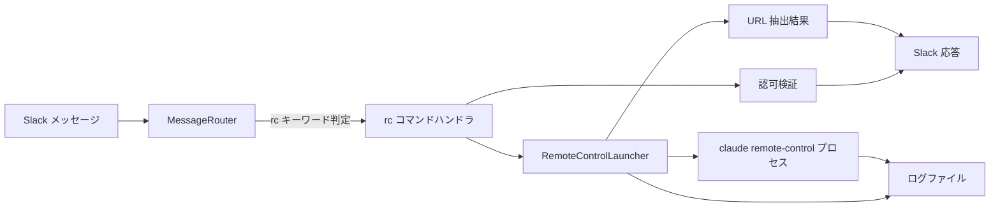

# Remote Control 起動

## 概要

Slack コマンドにより、ホスト PC 上で `claude remote-control` プロセスをバックグラウンド起動し、claude.ai/code から接続可能な URL を Slack に返す機能。
外出先のスマートフォン・PC から、ホスト PC に SSH 等で入らずに、新しい Claude Code セッションを起動して操作できるようにする。

## 背景

- 外出先からホスト PC のリポジトリで作業を始めたい場合、現状はホスト PC に物理的にアクセスして `claude remote-control` を手動起動する必要がある
- Slack 経由で起動を指示できれば、PC 操作なしでセッション起動 → claude.ai/code 接続まで完結する
- ホスト PC に複数のリポジトリがあり、作業対象のリポジトリで起動する必要がある（任意ディレクトリでの起動は禁止）

## 制約

- **二重 allowlist 方式**: 認可ユーザー allowlist と repo-key allowlist の両方を通過した場合のみ起動可能。任意のパス・任意のユーザーでの起動は拒否する。Slack 経由で任意プロセスを起動可能になることを防ぐため
- **起動コマンドはリスト引数で渡す**: `subprocess` の `shell=False` でリスト引数を渡し、コマンドインジェクションを防止する
- **`claude` CLI v2.1.51+ を運用前提とする**: Remote Control 機能はこのバージョン以降で利用可能。本機能の実装は `claude` 実行ファイルの **存在確認のみ**を行い、版数検証は運用で担保する（ホスト PC の `claude` インストール時に版数を満たすこと）。未インストール時は PATH エラーを返す。版数不一致時の検出は本機能のスコープ外
- **ホスト OS 前提**: Windows 11（本プロジェクトの主要運用環境）。subprocess のデタッチ起動方式は OS ごとに分岐する
- **claude にログイン済みであること**: ホスト PC で `claude auth` 等によるログインが完了していない場合、起動した remote-control プロセスは接続できない。ログイン状態は本機能の前提条件として運用で担保する
- **起動するプロセスのライフサイクルは bot から独立**: bot 停止時に remote-control プロセスは道連れにしない（外出先ユーザーの作業中断を避けるため、デタッチ起動する）
- **起動時にプロセス停止・状態確認は提供しない**: 本機能のスコープは起動のみ。停止は claude.ai/code 側でのセッション終了、または手動 `kill` で行う

## 操作一覧

| 操作 | トリガー | 概要 |
|---|---|---|
| Remote Control 起動 | `rc start <repo-key>` キーワード | 指定リポジトリで `claude remote-control` を起動し、接続 URL を返す |

- メンション付き・自動返信チャンネルの両方で動作する

## 各操作の仕様

### Remote Control 起動

**トリガー**: メッセージが `rc start <repo-key>` の形式（先頭が `rc`、サブコマンドが `start`）

`<repo-key>` は **大文字小文字を区別する**（既存の `feed` / `rag` コマンドと同じく、設定ファイルに記述された通りの key と完全一致する必要がある）。

**振る舞い**:

1. 認可ユーザー allowlist にメッセージ送信者の Slack `user_id` が含まれるか検証する。含まれない場合は権限エラーを返して終了する
2. repo allowlist に `<repo-key>` が含まれるか検証する。含まれない場合は登録済み key 一覧を含むエラーを返して終了する
3. allowlist の対応パスが実在ディレクトリであることを検証する。存在しない場合は構成エラーを返して終了する
4. `claude` 実行ファイルが PATH 上で解決できることを検証する。解決できない場合は前提エラーを返して終了する
5. `<repo-key>` を含むセッション名（例: `slack-<repo-key>-<unix-timestamp>`）を組み立て、`claude remote-control --name <session_name>` をデタッチ起動する。標準出力・標準エラーは起動ログファイル（`<log_dir>/<session_name>.log`）に書き出す
6. ログファイルを最大 15 秒間ポーリングし、`https://claude.ai/code?environment=env_...` 形式の URL を抽出する。タイムアウト時はタイムアウトエラーを返す
7. 抽出した URL を Slack に返信する

**出力**:

成功時:

```
✅ Remote Control を起動しました
リポジトリ: ai-assistant
セッション名: slack-ai-assistant-1714389600
接続: https://claude.ai/code?environment=env_01RA4umL5SQpWtrHboXYJyeo
```

権限拒否時:

```
❌ このコマンドを実行する権限がありません
```

repo-key 未登録時:

```
❌ 未登録のリポジトリキーです: <入力値>
登録済み: ai-assistant, agent-commons, ...
```

その他のエラー（claude 未インストール / パス不在 / タイムアウト等）は、原因を特定しやすい簡潔なメッセージを返す。シークレット値・絶対パス全文はメッセージに含めない（公開チャンネルでの実行を想定）。

### サブコマンドの拡張余地

`rc stop` / `rc status` 等の追加は別 Issue で扱う。本機能のスコープは `rc start` のみ。

## 設定

設定値は3層分離方針（[`config-management.md`](../infrastructure/config-management.md)）に従う。
本機能の値はホスト PC ごとに異なる（リポジトリパス・許可する Slack ユーザー）ため、すべて環境依存値（`.env`）として管理する。

| 項目名 | 層 | 設計意図 |
|---|---|---|
| `REMOTE_CONTROL_ALLOWED_USERS` | 環境依存値 | Slack `user_id` のカンマ区切りリスト。空または未設定の場合は本機能は無効化される（誰も起動できない）。判定は Slack ワークスペース内で一意な `user_id`（例: `U01ABCDEF12`）と完全一致する |
| `REMOTE_CONTROL_REPOSITORIES` | 環境依存値 | `<repo-key>=<絶対パス>` のカンマ区切りリスト。同一 key の重複登録は起動時に検出して即エラー終了する（fail-fast） |
| `REMOTE_CONTROL_LOG_DIR` | 環境依存値 | 起動ログの出力先ディレクトリ。指定したディレクトリ直下に `<session_name>.log` を出力する。未指定時は `.tmp/remote-control/` |
| `remote_control_url_timeout` | 共通設定値 | 起動後にログから接続 URL を抽出するタイムアウト秒数 |

具体値の制約は pydantic Field 定義（`src/config/settings.py`）が SSoT。仕様書では設計意図のみを記述する。

## コンポーネント構成



| コンポーネント | 役割 |
|---|---|
| MessageRouter | `rc` キーワードで本ハンドラへルーティング |
| rc コマンドハンドラ | サブコマンド `start` の引数解析・エラー応答整形 |
| 認可検証 | user allowlist と repo allowlist の二重チェック |
| RemoteControlLauncher | `claude remote-control` のデタッチ起動・ログファイル経由での URL 抽出 |
| ログファイル | 起動プロセスの stdout/stderr。bot プロセスから独立して書き出される |

## エッジケース

| ケース | 振る舞い |
|---|---|
| `REMOTE_CONTROL_ALLOWED_USERS` が空 | 本機能は無効。任意のユーザーが拒否される（fail-closed） |
| `REMOTE_CONTROL_REPOSITORIES` が空 | repo-key 検証で必ず失敗する。実質的に本機能は無効 |
| 同じ `<repo-key>` で連続起動 | プロセスは別々に起動される（多重起動制御は本機能のスコープ外）。各セッションは異なる名前で claude.ai/code に並ぶ |
| URL 抽出タイムアウト | 起動した子プロセスは kill しない（接続自体は遅延後に成立する可能性があるため）。Slack にはタイムアウトエラーを返し、ログファイルパスを案内する |
| `claude` プロセスが即時終了 | 子プロセスの終了コードを検出してエラー応答する（終了コードを含む） |

## 関連ドキュメント

- [cli-adapter](cli-adapter.md): メッセージルーティング基盤（rc コマンドのルーティング層）
- [auto-reply](auto-reply.md): 自動返信チャンネルでのコマンド動作
- [config-management](../infrastructure/config-management.md): 設定の3層分離方針
- Claude Code Remote Control 公式ドキュメント: <https://code.claude.com/docs/en/remote-control>
