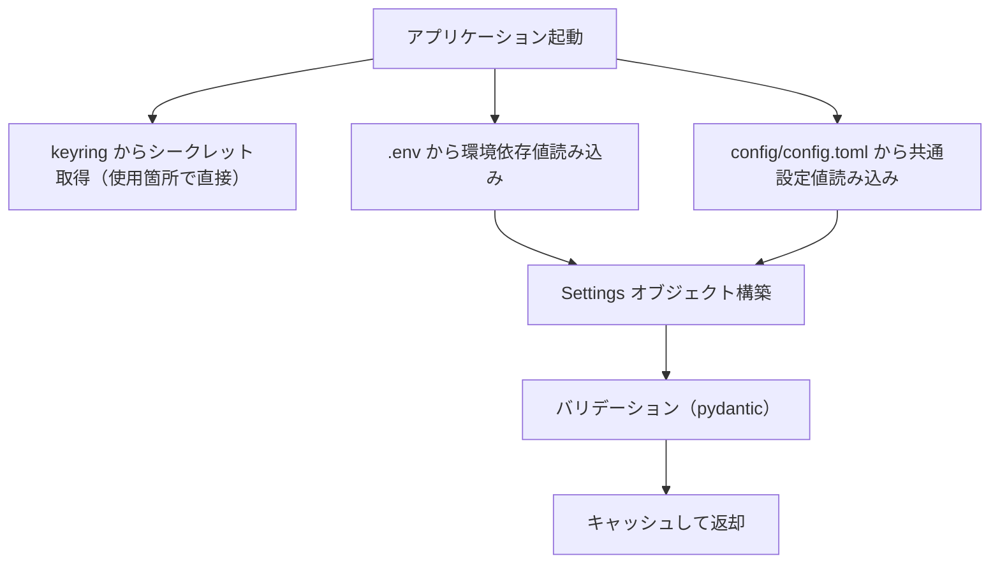

# 設定管理

## 概要

アプリケーション設定を「シークレット」「環境依存値」「共通設定値」の3層に分離し、各層に適した保管方式で管理する基盤機能。

## 背景

- `.env` ファイルに API キー・チャンネル ID・チューニングパラメータが混在しており、分類基準が不明確
- `.env` は git 管理外のため、共通設定値（チューニングパラメータ等）のバージョン管理ができない
- rag-knowledge リポジトリで確立した3層分離パターンを ai-assistant にも適用し、設定管理を統一する

## 制約

- 既存の `pydantic-settings` ベースの `Settings` クラスを拡張する形で実装する（フレームワーク変更は行わない）
- `config/assistant.yaml`（アシスタント性格設定）および `config/mcp_servers.json`（MCP サーバー設定）は本仕様の対象外とする。それぞれ独自の形式で適切に管理されている
- keyring のバックエンドは OS に依存する（Windows: Credential Manager、macOS: Keychain、Linux: Secret Service）。バックエンド固有の挙動差異は keyring ライブラリが吸収する

## インターフェース

### 3層分離モデル

| 層 | 保管先 | git 管理 | 分類基準 |
|---|---|---|---|
| シークレット | OS セキュアストレージ（keyring） | 管理外 | 漏洩時に直接被害が発生する認証情報・API キー |
| 環境依存値 | `.env` | 管理外 | デプロイ先・マシンごとに異なる値 |
| 共通設定値 | `config/config.toml` | **管理する** | プロジェクトとして統一管理するパラメータ |

### 設定値の取得元

各設定値の取得元は1つに固定する（フォールバックなし）:

| 層 | 取得元 | 取得方法 |
|---|---|---|
| シークレット | keyring のみ | py-common-lib の `get_secret(key=..., service="ai-assistant")` をサービス層で直接呼び出す |
| 環境依存値 | `.env` のみ | `_EnvLoader`（pydantic-settings）が読み込み、`Settings` に統合 |
| 共通設定値 | `config/config.toml` のみ | `_load_toml_config()` が読み込み、`Settings` に統合 |

環境変数による上書きは行わない。各層の設定値は指定された取得元からのみ取得する。

### 設定値の取得

`get_settings()` 関数がキャッシュ付きで `Settings` オブジェクトを返す。`Settings` にはシークレット層のフィールドを含まない。シークレットは使用箇所で `get_secret()` を直接呼び出して取得する。

### keyring 連携

keyring のサービス名は `ai-assistant`、キー名は環境変数名と同一にする（例: `SLACK_BOT_TOKEN`）。

keyring からの取得に失敗した場合（keyring 未インストール・キー未登録等）は `SecretNotFoundError` を送出する。フォールバックは行わない。

### config.toml の構造

```toml
openai_model = "gpt-4o-mini"
anthropic_model = "claude-3-5-sonnet-20241022"
lmstudio_model = "local-model"
timezone = "Asia/Tokyo"
feed_articles_per_feed = 10
feed_card_layout = "horizontal"
feed_summarize_timeout = 180
feed_collect_days = 7
thread_history_limit = 20
rag_show_sources = false
claude_allowed_tools = "mcp__rag-knowledge-production__*"
claude_timeout = 120
```

TOML はフラット構造（セクションなし）とし、キー名は `Settings` クラスのフィールド名と一致させる。

### 全設定値の3層分類

#### シークレット層（keyring）

漏洩時に直接被害が発生する認証情報。OS のセキュアストレージ（keyring）で管理する。

| 設定項目 | keyring キー名 | 説明 |
|---|---|---|
| `slack_bot_token` | `SLACK_BOT_TOKEN` | Slack Bot トークン |
| `slack_signing_secret` | `SLACK_SIGNING_SECRET` | Slack 署名シークレット |
| `slack_app_token` | `SLACK_APP_TOKEN` | Slack App トークン（Socket Mode 用） |
| `openai_api_key` | `OPENAI_API_KEY` | OpenAI API キー |
| `anthropic_api_key` | `ANTHROPIC_API_KEY` | Anthropic API キー |

#### 環境依存値層（.env）

デプロイ先・マシンごとに異なる値。`.env` ファイルで管理する。

| 設定項目 | 環境変数名 | デフォルト | 説明 |
|---|---|---|---|
| `lmstudio_base_url` | `LMSTUDIO_BASE_URL` | — | LM Studio の接続先 URL |
| `database_url` | `DATABASE_URL` | — | データベース接続文字列 |
| `slack_news_channel_id` | `SLACK_NEWS_CHANNEL_ID` | `""`（空文字列） | フィード配信先チャンネル ID |
| `slack_auto_reply_channels` | `SLACK_AUTO_REPLY_CHANNELS` | `""`（空文字列） | 自動返信チャンネル ID（カンマ区切り） |
| `env_name` | `ENV_NAME` | `""`（空文字列） | 環境名（ステータス表示用） |
| `mcp_enabled` | `MCP_ENABLED` | `false` | MCP 機能の有効/無効 |
| `mcp_servers_config` | `MCP_SERVERS_CONFIG` | `config/mcp_servers.json` | MCP サーバー設定ファイルパス |
| `log_level` | `LOG_LEVEL` | `INFO` | ログ出力レベル |
| `rag_bluesky_handle` | `RAG_BLUESKY_HANDLE` | `""`（空文字列） | RAG 定期更新対象の BlueSky ハンドル |
| `rag_zenn_username` | `RAG_ZENN_USERNAME` | `""`（空文字列） | RAG 定期更新対象の Zenn ユーザー名 |
| `online_llm_provider` | `ONLINE_LLM_PROVIDER` | — | オンライン LLM プロバイダー（`openai` / `anthropic`） |
| `chat_llm_provider` | `CHAT_LLM_PROVIDER` | — | チャット応答の LLM 選択（`local` / `online` / `claude`） |
| `profiler_llm_provider` | `PROFILER_LLM_PROVIDER` | — | ユーザー情報抽出の LLM 選択（`local` / `online`） |
| `topic_llm_provider` | `TOPIC_LLM_PROVIDER` | — | トピック提案の LLM 選択（`local` / `online`） |
| `summarizer_llm_provider` | `SUMMARIZER_LLM_PROVIDER` | — | 記事要約の LLM 選択（`local` / `online`） |

#### 共通設定値層（config.toml）

プロジェクトとして統一管理するパラメータ。`config/config.toml` で git 管理する。デフォルト値は持たない（config.toml に全値を明示する）。

| 設定項目 | config.toml キー名 | 許容範囲 | 説明 |
|---|---|---|---|
| `openai_model` | `openai_model` | — | OpenAI モデル名 |
| `anthropic_model` | `anthropic_model` | — | Anthropic モデル名 |
| `lmstudio_model` | `lmstudio_model` | — | LM Studio モデル名 |
| `timezone` | `timezone` | IANA タイムゾーン | アプリケーションのタイムゾーン |
| `feed_articles_per_feed` | `feed_articles_per_feed` | 1 以上の整数 | フィードごとの配信記事数上限 |
| `feed_card_layout` | `feed_card_layout` | `vertical` / `horizontal` | フィードカードのレイアウト |
| `feed_summarize_timeout` | `feed_summarize_timeout` | 0 以上の整数（秒、0=無制限） | 要約タイムアウト |
| `feed_collect_days` | `feed_collect_days` | 1 以上の整数 | 収集対象の日数 |
| `thread_history_limit` | `thread_history_limit` | 1〜100 | スレッド履歴取得の最大件数 |
| `rag_show_sources` | `rag_show_sources` | `true` / `false` | RAG 参照元 URL 表示（デバッグ用） |
| `claude_allowed_tools` | `claude_allowed_tools` | MCP ツールパターン文字列 | `chat_llm_provider=claude` の場合のみ必須。許可する MCP ツール（`--allowedTools` に渡す値） |
| `claude_timeout` | `claude_timeout` | 1 以上の整数（秒） | `chat_llm_provider=claude` の場合のみ必須。Claude CLI プロセスタイムアウト |

`claude_allowed_tools` と `claude_timeout` は条件付き必須項目である。`chat_llm_provider=claude` の場合は必須とし、いずれかが未設定なら起動時エラーとする。`chat_llm_provider=local` / `online` の場合は任意とし、設定されていてもアプリケーションは参照しない。

#### 分類判断の根拠

| 設定項目 | 分類 | 根拠 |
|---|---|---|
| `SLACK_BOT_TOKEN` 等 | シークレット | 認証トークン。漏洩でアカウント乗っ取りのリスク |
| `OPENAI_API_KEY` 等 | シークレット | API キー。漏洩で不正利用・課金被害のリスク |
| `LMSTUDIO_BASE_URL` | 環境依存値 | ローカル LLM のホスト・ポートはマシンごとに異なる |
| `DATABASE_URL` | 環境依存値 | DB ファイルパスはデプロイ先ごとに異なる |
| `SLACK_NEWS_CHANNEL_ID` | 環境依存値 | チャンネル ID は Slack ワークスペースごとに異なる |
| `ENV_NAME` | 環境依存値 | 環境識別子はデプロイ先ごとに異なる |
| `MCP_ENABLED` | 環境依存値 | MCP サーバーの有無はデプロイ環境に依存 |
| `LOG_LEVEL` | 環境依存値 | 本番・開発でログレベルを変えるため |
| `RAG_BLUESKY_HANDLE` | 環境依存値 | 取得対象アカウントはデプロイ環境ごとに異なりうる |
| `RAG_ZENN_USERNAME` | 環境依存値 | 取得対象アカウントはデプロイ環境ごとに異なりうる |
| LLM プロバイダー選択 | 環境依存値 | ローカル LLM（LM Studio）の有無はマシンごとに異なる |
| `TIMEZONE` | 共通設定値 | タイムゾーンはプロジェクト共通の運用方針であり環境ごとに変える必要がない |
| モデル名 | 共通設定値 | プロジェクトとして使用するモデルの統一管理 |
| Feed パラメータ | 共通設定値 | チューニングパラメータ。プロジェクト共通の値を git 管理する |
| `THREAD_HISTORY_LIMIT` | 共通設定値 | アプリケーション動作パラメータ。プロジェクト共通 |
| Claude CLI 設定 | 共通設定値 | Claude CLI モードの動作パラメータ。プロジェクト共通 |

## コンポーネント構成



| コンポーネント | 役割 |
|---|---|
| Settings クラス | 環境依存値と共通設定値を統合し、バリデーション済みの設定オブジェクトを提供する（シークレットは含まない） |
| TOML ローダー | `config/config.toml` を読み込み、未知キー検証を行い、共通設定値を `Settings` に供給する |
| `get_settings()` | `Settings` のキャッシュ付きシングルトンアクセスを提供する |

## エッジケース

| ケース | 振る舞い |
|---|---|
| `config/config.toml` が存在しない | `FileNotFoundError` で起動中止 |
| `config/config.toml` に未知のキーが含まれる | `ValueError` で起動中止 |
| `config/config.toml` のバリデーションエラー | 起動時にエラーメッセージを出力して中止 |
| keyring 未設定（キー未登録） | `SecretNotFoundError` を送出（フォールバックなし） |
| Slack 必須シークレットが未設定 | 起動時にエラーメッセージを出力して中止する。必須項目: `SLACK_BOT_TOKEN`、`SLACK_APP_TOKEN`、`SLACK_SIGNING_SECRET` |
| 任意シークレットが未設定（`OPENAI_API_KEY` 等） | 該当機能使用時に `SecretNotFoundError` |
| `claude_allowed_tools` が空文字列 | Claude CLI にツール許可を渡さない（ツールなしで応答） |

## 関連ドキュメント

- [全体仕様概要](../overview.md) — LLM 使い分けルール・設定一覧
- [MCP 統合](mcp-integration.md) — MCP 関連設定（`mcp_enabled`、`mcp_servers_config`）
- [チャット応答](../features/chat-response.md) — Claude CLI モード（`claude_allowed_tools`、`claude_timeout`）
- [RAG ナレッジ](rag-knowledge.md) — RAG 関連設定（`rag_show_sources`、`rag_bluesky_handle`、`rag_zenn_username`）
