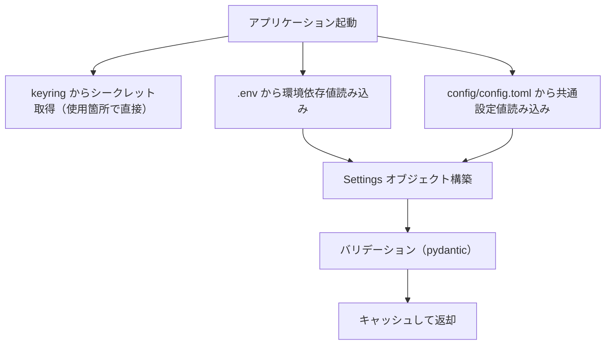

# 設定管理

## 概要

アプリケーション設定を「シークレット」「環境依存値」「共通設定値」の3層に分離し、各層に適した保管方式で管理する基盤機能。

## 背景

- `.env` ファイルに API キー・チャンネル ID・チューニングパラメータが混在しており、分類基準が不明確
- `.env` は git 管理外のため、共通設定値（チューニングパラメータ等）のバージョン管理ができない
- rag-knowledge リポジトリで確立した3層分離パターンを ai-assistant にも適用し、設定管理を統一する

## 制約

- 既存の `pydantic-settings` ベースの `Settings` クラスを拡張する形で実装する（フレームワーク変更は行わない）
- `config/assistant.yaml`（アシスタント性格設定・MCP プロンプト）は本仕様の対象外とする。YAML 形式で適切に管理されている
- keyring のバックエンドは OS に依存する（Windows: Credential Manager、macOS: Keychain、Linux: Secret Service）。バックエンド固有の挙動差異は keyring ライブラリが吸収する

## インターフェース

### 3層分離モデル

| 層 | 保管先 | git 管理 | 分類基準 |
|---|---|---|---|
| シークレット | OS セキュアストレージ（keyring） | 管理外 | 漏洩時に直接被害が発生する認証情報・API キー |
| 環境依存値 | `.env` | 管理外 | デプロイ先・マシンごとに異なる値 |
| 共通設定値 | `config/config.toml` | **管理する** | プロジェクトとして統一管理するパラメータ |

### 設定値の取得元

各設定値の取得元は1つに固定する（フォールバックなし）:

| 層 | 取得元 | 取得方法 |
|---|---|---|
| シークレット | keyring のみ | py-common-lib の `get_secret(key=..., service="ai-assistant")` をサービス層で直接呼び出す |
| 環境依存値 | `.env` のみ | `_EnvLoader`（pydantic-settings）が読み込み、`Settings` に統合 |
| 共通設定値 | `config/config.toml` のみ | `_load_toml_config()` が読み込み、`Settings` に統合 |

環境変数による上書きは行わない。各層の設定値は指定された取得元からのみ取得する。

### 設定値の取得

`get_settings()` 関数がキャッシュ付きで `Settings` オブジェクトを返す。`Settings` にはシークレット層のフィールドを含まない。シークレットは使用箇所で `get_secret()` を直接呼び出して取得する。

### keyring 連携

keyring のサービス名は `ai-assistant`、キー名は環境変数名と同一にする（例: `SLACK_BOT_TOKEN`）。

keyring からの取得に失敗した場合（keyring 未インストール・キー未登録等）は `SecretNotFoundError` を送出する。フォールバックは行わない。

### config.toml の構造

```toml
openai_model = "gpt-4o-mini"
anthropic_model = "claude-3-5-sonnet-20241022"
lmstudio_model = "local-model"
timezone = "Asia/Tokyo"
feed_articles_per_feed = 10
feed_card_layout = "horizontal"
feed_summarize_timeout = 180
feed_collect_days = 7
thread_history_limit = 20
rag_show_sources = true
rag_bluesky_max_posts = 100
rag_zenn_max_articles = 10
claude_allowed_tools = "mcp__rag-knowledge-production__*,WebSearch,WebFetch"
claude_timeout = 120
log_file_max_bytes = 10485760
```

TOML はフラット構造（セクションなし）とし、キー名は `Settings` クラスのフィールド名と一致させる。

### 全設定値の3層分類

#### シークレット層（keyring）

漏洩時に直接被害が発生する認証情報。OS のセキュアストレージ（keyring）で管理する。

| 項目名 | 層 | 設計意図 |
|---|---|---|
| `slack_bot_token` | シークレット | Slack API 認証に使用。漏洩でアカウント乗っ取りのリスクがある |
| `slack_signing_secret` | シークレット | Slack リクエスト署名の検証に使用。漏洩でなりすましのリスクがある |
| `slack_app_token` | シークレット | Socket Mode 接続の認証に使用。漏洩でアカウント乗っ取りのリスクがある |
| `openai_api_key` | シークレット | OpenAI API の認証に使用。漏洩で不正利用・課金被害のリスクがある |
| `anthropic_api_key` | シークレット | Anthropic API の認証に使用。漏洩で不正利用・課金被害のリスクがある |

#### 環境依存値層（.env）

デプロイ先・マシンごとに異なる値。`.env` ファイルで管理する。

| 項目名 | 層 | 設計意図 |
|---|---|---|
| `lmstudio_base_url` | 環境依存値 | ローカル LLM サーバーのホスト・ポートはマシンごとに異なる |
| `database_url` | 環境依存値 | DB ファイルパスはデプロイ先ごとに異なる |
| `slack_news_channel_id` | 環境依存値 | フィード配信先チャンネル ID は Slack ワークスペースごとに異なる |
| `slack_auto_reply_channels` | 環境依存値 | 自動返信対象チャンネルはワークスペースごとに異なる |
| `env_name` | 環境依存値 | ステータス表示用の環境識別子はデプロイ先ごとに異なる |
| `mcp_enabled` | 環境依存値 | MCP サーバーの有無はデプロイ環境に依存する |
| `mcp_rag_transport` | 環境依存値 | MCP サーバーの接続方式はデプロイ環境に依存する |
| `mcp_rag_url` | 環境依存値 | MCP サーバーのエンドポイント URL はデプロイ先ごとに異なる |
| `log_level` | 環境依存値 | 本番・開発でログ出力レベルを変える必要がある |
| `debug_log_enabled` | 環境依存値 | 開発・調査時にデバッグレベルのログ出力を有効にする |
| `log_dir` | 環境依存値 | ログファイルの出力先ディレクトリをデプロイ先ごとに指定する |
| `rag_bluesky_handle` | 環境依存値 | RAG 定期更新の対象 BlueSky アカウントはデプロイ環境ごとに異なりうる |
| `rag_zenn_username` | 環境依存値 | RAG 定期更新の対象 Zenn アカウントはデプロイ環境ごとに異なりうる |
| `online_llm_provider` | 環境依存値 | オンライン利用時の API プロバイダーを切り替える |
| `chat_llm_provider` | 環境依存値 | 利用する LLM をローカル・オンライン・Claude CLI で切り替える |
| `summarizer_llm_provider` | 環境依存値 | 同上（ローカルとオンラインの切り替え） |
| `remote_control_allowed_users` | 環境依存値 | Remote Control 起動を許可する Slack ユーザーはデプロイ環境ごとに異なる |
| `remote_control_repositories` | 環境依存値 | Remote Control 対象リポジトリの絶対パスはホスト PC ごとに異なる |
| `remote_control_log_dir` | 環境依存値 | Remote Control 起動ログの出力先ディレクトリをホストごとに指定する |

#### 共通設定値層（config.toml）

プロジェクトとして統一管理するパラメータ。`config/config.toml` で git 管理する。デフォルト値は持たない（config.toml に全値を明示する）。

| 項目名 | 層 | 設計意図 |
|---|---|---|
| `openai_model` | 共通設定値 | プロジェクトとして使用する OpenAI モデルを統一管理する |
| `anthropic_model` | 共通設定値 | プロジェクトとして使用する Anthropic モデルを統一管理する |
| `lmstudio_model` | 共通設定値 | プロジェクトとして使用するローカル LLM モデルを統一管理する |
| `timezone` | 共通設定値 | タイムゾーンはプロジェクト共通の運用方針であり環境ごとに変える必要がない |
| `feed_articles_per_feed` | 共通設定値 | フィードごとの配信記事数を制限しチャンネルの可読性を維持する |
| `feed_card_layout` | 共通設定値 | フィードカードの表示形式をプロジェクトとして統一する |
| `feed_summarize_timeout` | 共通設定値 | LLM 要約処理のタイムアウトを設けて無応答時の待機を防止する |
| `feed_collect_days` | 共通設定値 | 収集対象の日数を制限し処理量を抑制する |
| `thread_history_limit` | 共通設定値 | スレッド履歴の取得件数を制限しコンテキストサイズを制御する |
| `rag_show_sources` | 共通設定値 | RAG 参照元 URL の表示可否をデバッグ目的で制御する |
| `rag_bluesky_max_posts` | 共通設定値 | BlueSky 定期更新でクロールする投稿数の上限を制御する |
| `rag_zenn_max_articles` | 共通設定値 | Zenn 定期更新でクロールする記事数の上限を制御する |
| `claude_allowed_tools` | 共通設定値 | Claude CLI モードで許可する MCP ツールを制御する |
| `claude_timeout` | 共通設定値 | Claude CLI プロセスのタイムアウトを設けて無応答時の待機を防止する |
| `log_file_max_bytes` | 共通設定値 | ログファイル1つあたりの最大サイズを制御する（超過時にセッション単位で新ファイルへ切り替え、旧ファイルは保持） |
| `remote_control_url_timeout` | 共通設定値 | Remote Control 起動時に接続 URL を抽出するタイムアウト秒数を制御する |

`claude_allowed_tools` と `claude_timeout` は条件付き必須項目である。`chat_llm_provider=claude` の場合は必須とし、いずれかが未設定なら起動時エラーとする。`chat_llm_provider=local` / `online` の場合は任意とし、設定されていてもアプリケーションは参照しない。

## コンポーネント構成



| コンポーネント | 役割 |
|---|---|
| Settings クラス | 環境依存値と共通設定値を統合し、バリデーション済みの設定オブジェクトを提供する（シークレットは含まない） |
| TOML ローダー | `config/config.toml` を読み込み、未知キー検証を行い、共通設定値を `Settings` に供給する |
| `get_settings()` | `Settings` のキャッシュ付きシングルトンアクセスを提供する |

## エッジケース

| ケース | 振る舞い |
|---|---|
| `config/config.toml` が存在しない | `FileNotFoundError` で起動中止 |
| `config/config.toml` に未知のキーが含まれる | `ValueError` で起動中止 |
| `config/config.toml` のバリデーションエラー | 起動時にエラーメッセージを出力して中止 |
| keyring 未設定（キー未登録） | `SecretNotFoundError` を送出（フォールバックなし） |
| Slack 必須シークレットが未設定 | 起動時にエラーメッセージを出力して中止する。必須項目: `SLACK_BOT_TOKEN`、`SLACK_APP_TOKEN`、`SLACK_SIGNING_SECRET` |
| 任意シークレットが未設定（`OPENAI_API_KEY` 等） | 該当機能使用時に `SecretNotFoundError` |
| `claude_allowed_tools` が空文字列 | Claude CLI にツール許可を渡さない（ツールなしで応答） |

## 関連ドキュメント

- [全体仕様概要](../overview.md) — LLM 使い分けルール・設定一覧
- [MCP 統合](mcp-integration.md) — MCP 関連設定（`mcp_enabled`、`mcp_rag_transport`、`mcp_rag_url`）
- [チャット応答](../features/chat-response.md) — Claude CLI モード（`claude_allowed_tools`、`claude_timeout`）
- [RAG ナレッジ](rag-knowledge.md) — RAG 関連設定（`rag_show_sources`、`rag_bluesky_handle`、`rag_zenn_username`）
