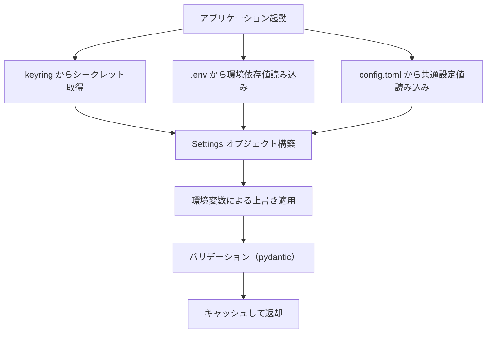

# 設定管理

## 概要

アプリケーション設定を「シークレット」「環境依存値」「共通設定値」の3層に分離し、各層に適した保管方式で管理する基盤機能。

## 背景

- `.env` ファイルに API キー・チャンネル ID・チューニングパラメータが混在しており、分類基準が不明確
- `.env` は git 管理外のため、共通設定値（チューニングパラメータ等）のバージョン管理ができない
- rag-knowledge リポジトリで確立した3層分離パターンを ai-assistant にも適用し、設定管理を統一する

## 制約

- 移行は段階的に行う。本仕様書は最終形の設計を定義し、実装は後続 Issue で段階的に進める
- 既存の `pydantic-settings` ベースの `Settings` クラスを拡張する形で実装する（フレームワーク変更は行わない）
- `config/assistant.yaml`（アシスタント性格設定）および `config/mcp_servers.json`（MCP サーバー設定）は本仕様の対象外とする。それぞれ独自の形式で適切に管理されている
- keyring のバックエンドは OS に依存する（Windows: Credential Manager、macOS: Keychain、Linux: Secret Service）。バックエンド固有の挙動差異は keyring ライブラリが吸収する

## インターフェース

### 3層分離モデル

| 層 | 保管先 | git 管理 | 分類基準 |
|---|---|---|---|
| シークレット | OS セキュアストレージ（keyring） | 管理外 | 漏洩時に直接被害が発生する認証情報・API キー |
| 環境依存値 | `.env` | 管理外 | デプロイ先・マシンごとに異なる値 |
| 共通設定値 | `config/config.toml` | **管理する** | プロジェクトとして統一管理するパラメータ |

### 設定値の解決優先順位

同一の設定項目が複数の層に存在する場合、以下の優先順位で解決する:

1. 環境変数（`.env` / シェル環境変数）
2. `config/config.toml`
3. コード上のデフォルト値

環境変数による上書きは、デバッグ・一時的な変更・CI 環境での挙動変更に使用する。

### 設定値の取得

`get_settings()` 関数がキャッシュ付きで `Settings` オブジェクトを返す。呼び出し元は設定値のソース（keyring / `.env` / `config.toml`）を意識しない。

### keyring 連携

keyring のサービス名は `ai-assistant`、キー名は環境変数名と同一にする（例: `SLACK_BOT_TOKEN`）。

keyring からの取得に失敗した場合（keyring 未インストール・キー未登録等）、従来どおり環境変数からの読み込みにフォールバックする。これにより、keyring 未設定の開発環境でも `.env` のみで動作する。

### config.toml の構造

```toml
[llm]
online_provider = "openai"
chat_provider = "local"
profiler_provider = "local"
topic_provider = "local"
summarizer_provider = "local"

[llm.openai]
model = "gpt-4o-mini"

[llm.anthropic]
model = "claude-3-5-sonnet-20241022"

[llm.lmstudio]
model = "local-model"

[app]
timezone = "Asia/Tokyo"

[feed]
articles_per_feed = 10
card_layout = "horizontal"
summarize_timeout = 180
collect_days = 7

[thread]
history_limit = 20

[rag]
show_sources = false
```

### 全設定値の3層分類

#### シークレット層（keyring へ移行）

漏洩時に直接被害が発生する認証情報。OS のセキュアストレージ（keyring）で管理する。

| 設定項目 | 現行環境変数 | 説明 |
|---|---|---|
| `slack_bot_token` | `SLACK_BOT_TOKEN` | Slack Bot トークン |
| `slack_signing_secret` | `SLACK_SIGNING_SECRET` | Slack 署名シークレット |
| `slack_app_token` | `SLACK_APP_TOKEN` | Slack App トークン（Socket Mode 用） |
| `openai_api_key` | `OPENAI_API_KEY` | OpenAI API キー |
| `anthropic_api_key` | `ANTHROPIC_API_KEY` | Anthropic API キー |

#### 環境依存値層（.env に残留）

デプロイ先・マシンごとに異なる値。`.env` ファイルで管理する。

| 設定項目 | 現行環境変数 | デフォルト | 説明 |
|---|---|---|---|
| `lmstudio_base_url` | `LMSTUDIO_BASE_URL` | `http://localhost:1234` | LM Studio の接続先 URL |
| `database_url` | `DATABASE_URL` | `sqlite+aiosqlite:///./ai_assistant.db` | データベース接続文字列 |
| `slack_news_channel_id` | `SLACK_NEWS_CHANNEL_ID` | （なし） | フィード配信先チャンネル ID |
| `slack_auto_reply_channels` | `SLACK_AUTO_REPLY_CHANNELS` | （なし） | 自動返信チャンネル ID（カンマ区切り） |
| `env_name` | `ENV_NAME` | （なし） | 環境名（ステータス表示用） |
| `mcp_enabled` | `MCP_ENABLED` | `false` | MCP 機能の有効/無効 |
| `mcp_servers_config` | `MCP_SERVERS_CONFIG` | `config/mcp_servers.json` | MCP サーバー設定ファイルパス |
| `log_level` | `LOG_LEVEL` | `INFO` | ログ出力レベル |

#### 共通設定値層（config.toml へ移行）

プロジェクトとして統一管理するパラメータ。`config/config.toml` で git 管理する。

| 設定項目 | 現行環境変数 | デフォルト | 許容範囲 | 説明 |
|---|---|---|---|---|
| `online_llm_provider` | `ONLINE_LLM_PROVIDER` | `openai` | `openai` / `anthropic` | オンライン LLM プロバイダー |
| `chat_llm_provider` | `CHAT_LLM_PROVIDER` | `local` | `local` / `online` | チャット応答の LLM 選択 |
| `profiler_llm_provider` | `PROFILER_LLM_PROVIDER` | `local` | `local` / `online` | ユーザー情報抽出の LLM 選択 |
| `topic_llm_provider` | `TOPIC_LLM_PROVIDER` | `local` | `local` / `online` | トピック提案の LLM 選択 |
| `summarizer_llm_provider` | `SUMMARIZER_LLM_PROVIDER` | `local` | `local` / `online` | 記事要約の LLM 選択 |
| `openai_model` | `OPENAI_MODEL` | `gpt-4o-mini` | — | OpenAI モデル名 |
| `anthropic_model` | `ANTHROPIC_MODEL` | `claude-3-5-sonnet-20241022` | — | Anthropic モデル名 |
| `lmstudio_model` | `LMSTUDIO_MODEL` | `local-model` | — | LM Studio モデル名 |
| `timezone` | `TIMEZONE` | `Asia/Tokyo` | IANA タイムゾーン | アプリケーションのタイムゾーン |
| `feed_articles_per_feed` | `FEED_ARTICLES_PER_FEED` | `10` | 1 以上の整数 | フィードごとの配信記事数上限 |
| `feed_card_layout` | `FEED_CARD_LAYOUT` | `horizontal` | `vertical` / `horizontal` | フィードカードのレイアウト |
| `feed_summarize_timeout` | `FEED_SUMMARIZE_TIMEOUT` | `180` | 0 以上の整数（秒、0=無制限） | 要約タイムアウト |
| `feed_collect_days` | `FEED_COLLECT_DAYS` | `7` | 1 以上の整数 | 収集対象の日数 |
| `thread_history_limit` | `THREAD_HISTORY_LIMIT` | `20` | 1〜100 | スレッド履歴取得の最大件数 |
| `rag_show_sources` | `RAG_SHOW_SOURCES` | `false` | `true` / `false` | RAG 参照元 URL 表示（デバッグ用） |

#### 分類判断の根拠

| 設定項目 | 分類 | 根拠 |
|---|---|---|
| `SLACK_BOT_TOKEN` 等 | シークレット | 認証トークン。漏洩でアカウント乗っ取りのリスク |
| `OPENAI_API_KEY` 等 | シークレット | API キー。漏洩で不正利用・課金被害のリスク |
| `LMSTUDIO_BASE_URL` | 環境依存値 | ローカル LLM のホスト・ポートはマシンごとに異なる |
| `DATABASE_URL` | 環境依存値 | DB ファイルパスはデプロイ先ごとに異なる |
| `SLACK_NEWS_CHANNEL_ID` | 環境依存値 | チャンネル ID は Slack ワークスペースごとに異なる |
| `ENV_NAME` | 環境依存値 | 環境識別子はデプロイ先ごとに異なる |
| `MCP_ENABLED` | 環境依存値 | MCP サーバーの有無はデプロイ環境に依存 |
| `LOG_LEVEL` | 環境依存値 | 本番・開発でログレベルを変えるため |
| LLM プロバイダー選択 | 共通設定値 | プロジェクトとしてどの LLM を使うかの方針。環境ごとに変えたい場合は環境変数で上書き |
| モデル名 | 共通設定値 | プロジェクトとして使用するモデルの統一管理 |
| Feed パラメータ | 共通設定値 | チューニングパラメータ。プロジェクト共通の値を git 管理する |
| `THREAD_HISTORY_LIMIT` | 共通設定値 | アプリケーション動作パラメータ。プロジェクト共通 |

## コンポーネント構成



| コンポーネント | 役割 |
|---|---|
| Settings クラス | 3つのソースを統合し、バリデーション済みの設定オブジェクトを提供する |
| TOML ローダー | `config/config.toml` を読み込み、共通設定値を `Settings` に供給する |
| keyring アクセサー | OS セキュアストレージからシークレットを取得し、`Settings` に供給する |
| `get_settings()` | `Settings` のキャッシュ付きシングルトンアクセスを提供する |

## エッジケース

| ケース | 振る舞い |
|---|---|
| `config.toml` が存在しない | デフォルト値で動作する（`config.toml` は任意） |
| keyring 未インストール・取得失敗 | 環境変数にフォールバック |
| 環境変数と `config.toml` の両方に同一キーが存在 | 環境変数を優先 |
| `config.toml` のバリデーションエラー | 起動時にエラーメッセージを出力して中止 |
| シークレットが未設定（keyring にも環境変数にもない） | 空文字列のまま（該当機能使用時にエラー） |

## 関連ドキュメント

- [全体仕様概要](../overview.md) — LLM 使い分けルール・設定一覧
- [MCP 統合](mcp-integration.md) — MCP 関連設定（`mcp_enabled`、`mcp_servers_config`）
- [RAG ナレッジ](rag-knowledge.md) — RAG 関連設定（`rag_show_sources`）
