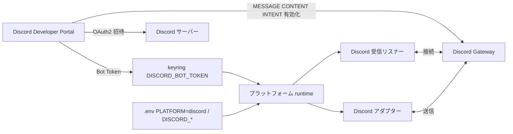

# Discord セットアップ

## 概要

AI Assistant を Discord 上で稼働させるための、Discord 側（Developer Portal）と本アプリ側（keyring・`.env`）のセットアップ手順を定義する。`PLATFORM=discord` での起動に必要な準備をまとめる。

メッセージング抽象・プラットフォーム選択の設計は [CLI アダプター](../features/cli-adapter.md) を、設定値の3層分離は [設定管理](config-management.md) を参照。

## 背景

- 既存の bot は Slack 固定で稼働しており、Discord で動かすにはアプリ登録・トークン取得・intent 有効化・サーバー招待という Discord 固有の準備が必要
- これらは Developer Portal 上の手動操作（ユーザー操作必須）を含むため、手順を明文化し再現可能にする

## 制約

- **MESSAGE CONTENT INTENT は必須**。privileged intent であり、無効だとギルドチャンネルでメッセージ本文・添付が空になり bot が本文を読めない（Developer Portal 側の有効化が手動で必要。コード側の `message_content` intent はアプリに実装済み）
- **Bot Token はシークレット**として keyring（サービス名: `ai-assistant`、キー名 `DISCORD_BOT_TOKEN`）で管理する。`.env` やコードに平文で置かない
- **稼働プラットフォームは単一**。同時稼働ではなく `.env` の `PLATFORM` で 1 つを選ぶ。`PLATFORM=discord` 時は `DISCORD_BOT_TOKEN` のみ必須シークレットとして起動時検証される
- bot には招待時に最小権限（メッセージ送信・履歴閲覧・ファイル添付・スレッド作成・Embed）を付与する。権限不足の操作は Discord API エラーになる
- 前提として Discord アカウントと招待先サーバー（ギルド）、本アプリのランタイム（Python 3.11+ / uv）が用意済みであること

## インターフェース

### セットアップ手順

#### 1. Developer Portal でアプリケーション作成

1. [Discord Developer Portal](https://discord.com/developers/applications) にログインする
2. **New Application** でアプリケーションを作成する（名前は任意。bot の表示名は後から変更可能）

#### 2. Bot の追加と Bot Token の取得

1. 作成したアプリケーションの **Bot** セクションを開く
2. Bot Token を発行・コピーする（**この値はシークレット**。再表示できないため安全に控える）
3. Token は本アプリ側で keyring に登録する（手順 5）

#### 3. MESSAGE CONTENT INTENT の有効化（必須）

1. **Bot** セクションの **Privileged Gateway Intents** で **MESSAGE CONTENT INTENT** を ON にする
2. これが無効だとギルドチャンネルでメッセージ本文・添付ファイルが空になり、bot がコマンド・チャットを読めない（本 bot は本文を読むため必須）
3. 個人運用規模では Portal 上でそのまま有効化できる（大規模公開 bot は Discord 側の審査が必要になる場合がある）

> コード側の intent 有効化（`message_content`）はアプリに実装済みのため、Portal 側の ON のみが手動作業。

#### 4. OAuth2 でサーバーへ招待

1. **OAuth2** の URL ジェネレーターで scope に `bot` を選択する
2. Bot Permissions に以下を付与する（本 bot の全機能に必要な最小権限）:
   - View Channels（チャンネル閲覧）
   - Send Messages（メッセージ送信）
   - Read Message History（スレッド履歴取得）
   - Attach Files（CSV エクスポート等のファイル送信）
   - Create Public Threads（フィード配信スレッドの作成）
   - Embed Links（記事カードの Embed 表示）
3. 生成された招待 URL をブラウザで開き、対象サーバーへ bot を招待する

#### 5. keyring に Bot Token を登録

`DISCORD_BOT_TOKEN` を keyring（サービス名: `ai-assistant`）に登録する。登録方法は [py-common-lib のシークレットストア仕様](https://github.com/becky3/py-common-lib/blob/main/docs/specs/infrastructure/secret-store.md) を参照。

#### 6. `.env` の設定

`.env` に以下を設定する。チャンネル ID・ユーザー ID は Discord クライアントの**開発者モードを有効化**（ユーザー設定 → 詳細設定 → 開発者モード）し、対象を右クリック →「ID をコピー」で取得する:

| キー | 値 | 説明 |
|---|---|---|
| `PLATFORM` | `discord` | 稼働プラットフォームを Discord に切り替える |
| `DISCORD_NEWS_CHANNEL_ID` | チャンネル ID | フィード配信先チャンネル |
| `DISCORD_AUTO_REPLY_CHANNELS` | チャンネル ID（カンマ区切り） | メンション不要で自動応答するチャンネル群（任意） |
| `DISCORD_REMOTE_CONTROL_ALLOWED_USERS` | ユーザー ID（カンマ区切り） | rc / article コマンドの認可ユーザー（Discord ID）。ID 体系が Slack と異なるため Discord 専用変数を用いる（任意） |

#### 7. 起動と動作確認

1. `uv run python -m src.main` で起動する
2. 起動時に必須シークレット `DISCORD_BOT_TOKEN` が検証される（未設定なら中止）
3. bot が Gateway に接続（`on_ready`）すると稼働状態になる
4. サーバーで `@bot status` 等のメンションに応答すれば疎通確認完了

### 定期トリガー（reminder）

Discord には Slack の Reminder に相当するネイティブ予約投稿機能がないため、毎朝のフィード配信等の定期実行は **外部のスケジュール投稿 bot（reminder bot）** から本 bot をメンションする投稿で起動する。本 bot は自分をメンションする他 bot の投稿を受理する（メンションを伴わない他 bot 発言はループ防止のため無視する）。

#### トリガー契約（この形式の投稿で起動する）

- 本 bot が閲覧できるチャンネルに投稿されていること
- 本 bot をメンションしていること（ユーザーメンション `@AI Companion` / bot 管理ロールメンションのどちらでも可）
- メンションを除いた本文が認識可能なコマンドであること（例: `deliver` / `feed test` / `status`）。Slack の `Reminder:` プレフィックスは不要で、コマンドをそのまま記述する
- 投稿者が bot / webhook でもよい（本 bot をメンションしていれば受理する）

例（毎朝の配信を起動）: スケジュール投稿の本文を `@AI Companion deliver` とする。

#### セットアップ手順

1. スケジュール投稿に対応した Discord bot（定期メッセージ／cron 投稿が可能な汎用 bot）を、本 bot と同じサーバーに招待する（招待手順は各 bot の提供元に従う）
2. その bot で「指定時刻に固定メッセージを投稿する」スケジュールを作成し、投稿先を配信用チャンネル、本文を `@AI Companion deliver`（や `@AI Companion feed test` 等）に設定する
3. メンションが本 bot の**ユーザー**または**管理ロール**に解決されていることを確認する（オートコンプリートで候補を選ぶ）

> Discord 標準の `/remind` はリマインダーを**実行ユーザー本人に通知**するだけで、チャンネルに bot 宛メッセージを投稿しないため、本 bot の起動には使えない。必ずチャンネルへ固定メッセージを投稿できるスケジュール bot / webhook を用いる。

#### 動作確認

スケジュール投稿 bot を待たずに確認するには、同じ本文（`@AI Companion deliver`）を手動で投稿してコマンドが起動するかを見る。スケジュール bot 設定後は、設定時刻に同等の投稿で起動することを確認する。

## コンポーネント構成

| コンポーネント | 役割 |
|---|---|
| Discord Developer Portal | アプリ・Bot 登録、Bot Token 発行、MESSAGE CONTENT INTENT 有効化、OAuth2 招待 URL 生成 |
| keyring（`DISCORD_BOT_TOKEN`） | Bot Token をシークレットとして保管。起動時に必須検証 |
| `.env`（`PLATFORM` / `DISCORD_*`） | プラットフォーム選択・配信/自動返信チャンネル ID |
| プラットフォーム runtime | `PLATFORM=discord` を解決し Discord 受信リスナー・送信アダプターを構築（実装の詳細は [CLI アダプター](../features/cli-adapter.md)） |

## エッジケース

| ケース | 振る舞い |
|---|---|
| `MESSAGE CONTENT INTENT` が無効 | メッセージ本文が空になりコマンド・チャットを認識できない（Portal で有効化が必要） |
| `DISCORD_BOT_TOKEN` 未登録で `PLATFORM=discord` 起動 | 起動時にエラーメッセージを出力して中止 |
| bot に必要権限（Send Messages 等）が付与されていない | 該当操作が Discord API エラーになる（招待時の権限付与で解消） |
| `DISCORD_NEWS_CHANNEL_ID` 未設定でフィード配信 | 配信先が空のため配信できない |

## 関連ドキュメント

- [CLI アダプター](../features/cli-adapter.md) — メッセージング抽象・プラットフォーム選択
- [設定管理](config-management.md) — シークレット・環境依存値の3層分離（`PLATFORM`・`DISCORD_*`）
- [情報収集・配信](../features/feed-management.md) — フィード配信（Discord は Embed カード）
