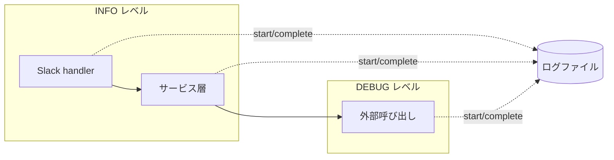

# ログ出力

## 概要

bot 全体のログ出力に関する基盤と運用パターンを定義する。Slack ハンドラ・主要サービスの観測性を統一し、再現困難な不具合の事後追跡を可能にする。

## 背景

`feed add` のレスポンスが本番で約 1 分かかる現象が発生したが、当時のログには handler の入口（`mention received` / `routing`）しか出ておらず、内部のどのステップで時間がかかったかをログ単独で特定できなかった。
一方 `ChatService.respond` は `respond start` / `respond complete` の 2 段ログがあり、LLM 呼び出しの所要時間を `respond start` と `respond complete` のタイムスタンプ差分で確認できる仕組みになっていた。

この差を全 handler / 主要サービスに展開し、原因調査時に「どの処理がどのタイミングで走ったか」をログだけで追跡可能にすることが本仕様の目的。

## 制約

- ログ出力は Python 標準の `logging` モジュールで行う。新規ロギングフレームワーク導入は行わない
- ログファイルは py-common-lib の `SessionRotatingFileHandler` を介してセッション単位でローテートされる。詳細は同ライブラリの仕様を参照
- 所要時間は明示計算しない。`start` ログと `complete` ログのタイムスタンプ差分から事後算出する（ロガーの asctime はミリ秒精度）
- シークレット（API キー・認証トークン）の値はログに出力しない（`~/.claude/rules/invariants.md`「秘匿情報の出力禁止」準拠）
- 構造化ログ（JSON 化）・外部ログ集約基盤（Loki / Datadog 等）は本仕様の対象外
- 本仕様は既存の外部通信に対しログを付与するのみで、リクエスト数・所要時間制御（タイムアウト・レート制限・リトライ）は行わない。それらの制御は各機能の仕様書に従う

## インターフェース

### ログレベル方針

| レベル | 用途 |
|---|---|
| INFO | handler の入口・完了、主要サービスの公開メソッドの入口・完了 |
| DEBUG | 副作用を伴う処理（HTTP / DB / 外部コマンド / LLM / MCP）の前後 |
| WARNING | 期待外の状態だが処理は継続する場合（タイムアウトでフォールバック、空応答時のフォールバック等） |
| ERROR | 例外発生時。`logger.exception()` を用い、stack trace 付きで `ERROR` レベルに出力する |

DEBUG レベルは `.env` の `DEBUG_LOG_ENABLED=true` で有効化できる（再起動が必要）。詳細は `config-management.md` を参照。

### ログメッセージのフォーマット

`<処理名> start: <文脈情報>` / `<処理名> complete: <結果情報>` の形式で統一する。

- **処理名**: `<クラス省略の関数名>` または `<モジュールの代表処理名>`（例: `handle_feed_add`, `fetch_feed_title`, `summarize`）
- **文脈情報**: 処理の入力を示す主要な値（URL・カテゴリ・件数等）。`key=value` 形式
- **結果情報**: 処理の出力を示す主要な値（成功件数・エラー件数・取得件数・結果ステータス等）

例（以下はロガーのメッセージ本文部分のみを示す。`asctime` / `levelname` / `name` 等のヘッダはハンドラ側で付与される）:

```
handle_feed_add start: urls=1, category=一般
handle_feed_add complete: success=1, error=0, total=1
```

```
fetch_feed_title start: url=https://example.com/rss
feedparser.parse start: url=https://example.com/rss
feedparser.parse complete: url=https://example.com/rss, entries=20
fetch_feed_title complete: url=https://example.com/rss, title='Example Feed'
```

### 早期 return 時の complete ログ

`if` 分岐や例外で早期 return する場合も、return 直前に `complete` ログを出して `start` と必ず対になるようにする。`complete` ログには `result=<状態名>` で原因を示す（例: `result=empty_urls`, `result=duplicate`, `result=timeout`）。

### 例外時の扱い

例外で関数が抜ける場合、既存の `logger.exception` で stack trace 付きログを出す方針を維持する。本仕様では `complete` ログを `try/finally` で必ず出すといった追加の構造化はしない（実装シンプル優先）。

## コンポーネント構成

呼び出しチェーン（Handler → サービス層 → 外部呼び出し）の各層が独立にログを出力する。INFO レベルで出る層と DEBUG レベルで出る層を視覚的に分離する:



### 適用対象

| 層 | 対象 | レベル |
|---|---|---|
| Slack handler | `src/messaging/router.py` の `_handle_*` 全て | INFO |
| サービス層 | `src/services/feed_collector.py` / `src/services/summarizer.py` / `src/services/ogp_extractor.py` / `src/services/thread_history.py` / `src/services/remote_control.py` の公開メソッド | INFO |
| スケジューラ | `src/scheduler/jobs.py` のトップレベル関数 | INFO |
| 外部呼び出し | `feedparser.parse` / `httpx GET` / `src/llm/claude_cli.py` の `call_claude` / `src/mcp_bridge/client_manager.py` の `call_tool` / DB の主要ポイント | DEBUG |

`ChatService.respond` の既存ログ（`respond start` / `respond complete` / `respond content`）はそのまま維持する（先行実装で本仕様に合致）。

## 外部連携

- ログファイル基盤: `py-common-lib.logging.SessionRotatingFileHandler`（外部リポジトリ）

## 関連ドキュメント

- `docs/specs/features/chat-response.md` — `ChatService.respond` のログパターン（本仕様の参考実装）
- `docs/specs/infrastructure/config-management.md` — ログ関連設定値（`debug_log_enabled` / `log_level` / `log_dir` / `log_file_max_bytes`）の SSoT
- `~/.claude/rules/invariants.md` — 秘匿情報の出力禁止
- py-common-lib の `SessionRotatingFileHandler` 仕様（外部リポジトリ）
