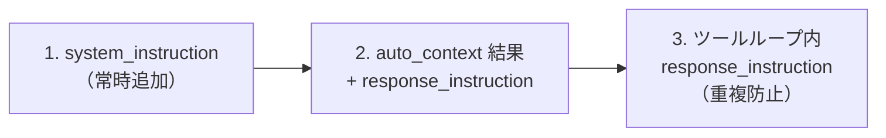
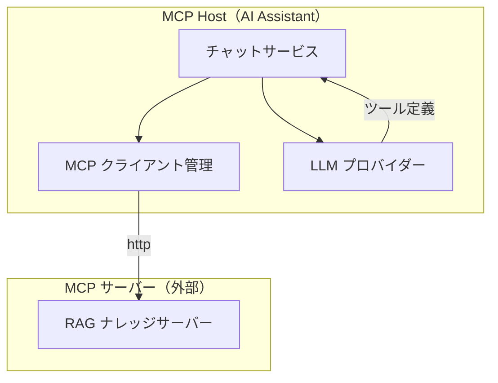
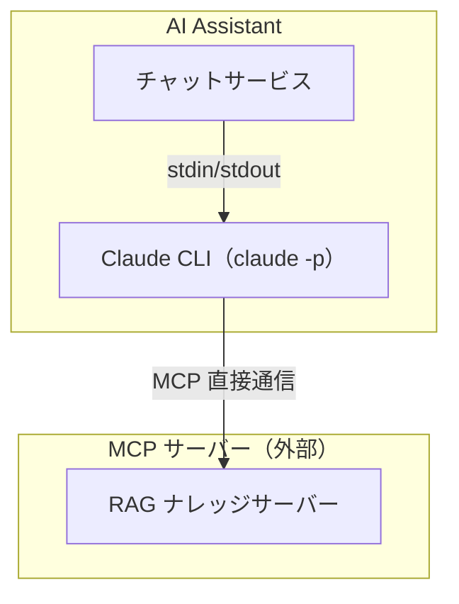

# MCP 統合

## 概要

Model Context Protocol（MCP）を活用して、チャットボットが外部ツールを動的に発見・呼び出しできる基盤。MCP サーバーを追加するだけでボットの対応範囲を拡張できる。

現在は外部リポジトリ（rag-knowledge）の RAG サーバーに HTTP で接続している。

## 背景

- LLM に対して定型的なプロンプトを送信し応答を得るのみで、外部ツールとの連携機能がなかった
- MCP（Anthropic が提唱、OpenAI・Linux Foundation も採用）はツール連携のオープン標準プロトコル
- MCP により、LLM がツールを動的に発見・呼び出しでき、エージェント的な振る舞いが可能になる

## 制約

### 機能制御

- `MCP_ENABLED` 環境変数で MCP 機能全体の ON/OFF を制御する
- MCP 無効時は従来どおりの動作をする（後方互換性）

### 安全弁

- ツール呼び出しループに最大反復回数を設ける。上限到達時はループを打ち切り、テキスト応答を強制する
- 個々のツール実行にタイムアウトを設ける。超過時はタイムアウトエラーとして処理し、エラー内容を LLM に返す
- `claude` モードでは上記の安全弁は Claude CLI 側の設定に委ねる（ai-assistant 側では `claude_timeout` によるプロセス全体のタイムアウトのみ制御する）

### ライフサイクル

- アプリ起動時に全サーバーへ接続する。失敗したサーバーはスキップし、ツールなしで続行する（グレースフルデグラデーション）
- サーバーの自動再起動・ヘルスチェックは行わない。初期実装ではシンプルさを優先し、障害回復はアプリ再起動で対応する
- アプリ終了時に全接続をクリーンアップし、子プロセスを停止する

### データ保存

- ツール呼び出しの中間ステップ（assistant + tool_calls、tool + 結果）は DB に保存しない。1 回の応答内で完結するため、スレッド再開時に再利用する必要がない

### トランスポート

- stdio（ローカルプロセス）および http（Streamable HTTP）をサポートする
- 設定ファイルの `transport` フィールドで接続方式を指定する
- http の場合は `url` フィールドにエンドポイント URL を指定する

## インターフェース

### MCP クライアント管理

ホストアプリが MCP サーバー群を管理するためのインターフェース。

| 操作 | 振る舞い |
| --- | --- |
| サーバー接続 | 設定ファイルに基づき全サーバーに接続。失敗したサーバーはスキップしてログ出力 |
| ツール一覧取得 | 全サーバーのツールをプロバイダー非依存の中間表現で返す |
| ツール実行 | 指定ツールを実行し結果を返す。ツール未発見時・実行失敗時は例外を送出 |
| システム指示取得 | 全サーバーの `system_instruction` を返す |
| 応答指示取得 | ツール名に対応するサーバーの `response_instruction` を返す |
| 自動コンテキストツール取得 | `auto_context_tool` が設定されたツール名のリストを返す |
| クリーンアップ | 全接続を閉じ、子プロセスを停止 |

### LLM プロバイダー拡張

既存の LLM 問い合わせに加え、ツール情報付きの問い合わせをサポートする。

| メソッド | 振る舞い |
| --- | --- |
| ツール付き問い合わせ | ツール定義リストを LLM に渡し、ツール呼び出し要求を含む応答を返す |

- 各プロバイダーがツール定義を自身の API 形式に変換する（OpenAI: Function Calling、Anthropic: Tool Use）
- ツール非対応プロバイダーはツールを無視して通常の問い合わせにフォールバックする

### MCP サーバー設定

JSON ファイルでサーバーの接続情報を管理する。

| フィールド | 説明 |
| --- | --- |
| `transport` | トランスポート種別（`stdio` または `http`） |
| `command` | 実行コマンド（stdio 時） |
| `args` | コマンド引数（stdio 時） |
| `env` | 環境変数（stdio 時） |
| `url` | エンドポイント URL（http 時） |
| `system_instruction` | システムプロンプトに常時追加する指示 |
| `response_instruction` | ツール実行後にシステムプロンプトへ追加する指示 |
| `auto_context_tool` | ユーザークエリで自動呼び出しし結果をコンテキスト注入するツール名 |

### ツール呼び出しフロー（local/online モード）

`chat_llm_provider` が `local` または `online` の場合に使用する方式。ai-assistant の MCP ブリッジがツール連携を管理する。

1. ユーザーが質問する
2. チャットサービスが会話履歴 + 利用可能ツール情報を LLM に送信する
3. LLM が tool_use レスポンスを返す場合:
   - MCP クライアント経由でツールを実行する
   - ツール結果を会話履歴に追加し、LLM に再送信する
   - テキスト応答が得られるまで繰り返す（最大反復回数まで）
4. LLM がテキスト応答を返す場合、そのまま応答として返す

### 指示の適用タイミング（local/online モード）

### Claude CLI モードでの MCP 連携

`chat_llm_provider` が `claude` の場合、ai-assistant の MCP ブリッジ（MCP クライアント管理・ツールループ・指示注入）は使用しない。Claude CLI（`claude -p`）が MCP ツールの発見・呼び出しを直接行う。

- Claude CLI は自身の MCP 設定に基づいて MCP サーバーに接続する
- `--allowedTools` フラグで許可するツールパターンを指定する（`claude_allowed_tools` 設定値）
- ツールの発見・呼び出し判断・ツールループは全て Claude CLI 内部で処理される
- rag-knowledge 側で新しい MCP ツールが追加された場合、ai-assistant 側の変更は不要（Claude CLI が自動的に発見する）

この方式により、MCP ツール連携のオーケストレーション（MCP クライアント管理・LLM プロバイダー拡張・指示の注入タイミング制御）を ai-assistant から Claude CLI に委譲する。

## コンポーネント構成

### local/online モード

### claude モード

| コンポーネント | 役割 |
| --- | --- |
| チャットサービス | 履歴取得・モード分岐・DB 保存のオーケストレーション |
| MCP クライアント管理 | （local/online）MCP サーバーへの接続管理、ツール一覧統合、ツール実行 |
| LLM プロバイダー | （local/online）ツール定義の API 形式変換、ツール呼び出し判断 |
| Claude CLI | （claude）ワンショット実行で応答生成。MCP ツール連携を内包 |
| MCP サーバー | 外部ツール・リソースの提供（MCP プロトコルで通信） |

## 外部連携

| 連携先 | プロトコル | 用途 |
| --- | --- | --- |
| RAG ナレッジサーバー | MCP（http） | ナレッジベース検索・管理 |

## エッジケース

| ケース | 振る舞い |
| --- | --- |
| サーバー接続失敗 | 該当サーバーをスキップし、他サーバーのツールのみで続行 |
| ツール実行エラー | エラー内容を LLM に伝え、LLM がユーザーに適切に回答 |
| ツールループ上限到達 | ループを打ち切り、上限到達メッセージを LLM に渡してテキスト応答を強制 |
| ツール実行タイムアウト | タイムアウトエラーとして処理し、エラー内容を LLM に返す |
| MCP 無効時 | 従来どおりの動作（ツールなしで応答） |
| 設定ファイル不在 | MCP 機能を無効として続行 |
| Claude CLI モードでの MCP 接続失敗 | Claude CLI が内部で処理する（ai-assistant 側での制御は不要） |

## 関連ドキュメント

- [RAG ナレッジ](rag-knowledge.md) — RAG 基盤（外部リポジトリに移行済み、MCP サーバーとして接続）
- [チャット応答](../features/chat-response.md) — ツール呼び出しループを含むチャット応答仕様
