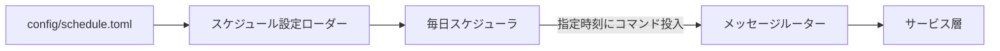

# 定時実行（内部スケジューラ）

## 概要

bot 内部のスケジューラで、ローカル設定ファイルに定義したコマンドを**毎日指定時刻**に無人実行する基盤機能。外部 reminder bot に依存せず、Slack / Discord 共通で動作する。

## 背景

- Discord には Slack の Reminder に相当する「bot を確実に起動できる予約投稿」機能が無く、定期実行（毎朝のフィード配信・RAG 更新・記事自動投稿）の代替手段が必要
- 外部スケジュール bot 経由（[Discord セットアップ](discord-setup.md) の reminder 節）は導入・運用の手間が大きい
- スケジュールをローカル設定ファイルで一元管理し、bot 起動時に読み込んで内部で定時実行する方式を提供する

## 制約

- スケジュール定義ファイルは **git 管理外**（環境ごとに異なるチャンネル ID・ユーザー ID を含むため）。`.gitignore` に登録する。テンプレート（`*.example`）のみ git 管理する
- 実行粒度は **毎日（every day）** のみ。時刻は `HH:MM`（24 時間制）で指定し、`settings.timezone` のタイムゾーンで解釈する
- 各ジョブは `IncomingMessage`（指定チャンネル・`user_id`）を構築して `MessageRouter.process_message` に渡して実行する。すなわち通常のコマンドと同一経路を通り、応答・配信先は指定チャンネルになる（メンション文字列は不要、コマンドのみ記述）
- 認可が必要なコマンド（例: `article write-hatena`）は、**稼働プラットフォームの許可リスト**（Slack=`REMOTE_CONTROL_ALLOWED_USERS` / Discord=`DISCORD_REMOTE_CONTROL_ALLOWED_USERS`）に含まれる `user_id` をジョブに指定する必要がある。未指定・非許可の場合はコマンド側で拒否される
- 設定ファイルが存在しない場合はスケジューラは無効（ジョブ 0 件）として正常起動する
- ジョブ実行中の例外は記録のうえ握り潰し、当該ジョブの次回実行・他ジョブに影響させない

## インターフェース

### 設定ファイル

`config/schedule.toml`（git 管理外）。テンプレートは `config/schedule.toml.example`。

| キー | 必須 | 内容 |
|---|---|---|
| `jobs[].time` | 必須 | 実行時刻 `HH:MM`（24 時間制、`settings.timezone` で解釈） |
| `jobs[].command` | 必須 | bot に流すコマンド文字列（例: `deliver` / `rag update` / `article write-hatena`） |
| `jobs[].channel` | 任意 | 応答・配信先チャンネル ID（省略時は配信先チャンネル `news_channel_id`） |
| `jobs[].user_id` | 任意 | 認可コマンド用の実行ユーザー ID（許可リスト照合に使用） |

記述例:

```toml
[[jobs]]
time = "00:10"
command = "rag update"

[[jobs]]
time = "03:00"
command = "deliver"

[[jobs]]
time = "04:30"
command = "article write-hatena"
user_id = "<許可リストに含まれるユーザーID>"
```

### 振る舞い

1. bot 起動時に設定ファイルを読み込み、各ジョブを毎日指定時刻に実行するタスクを起動する
2. 各タスクは「次回実行時刻までの待機 → コマンド実行 → 翌日の同時刻まで再待機」を繰り返す
3. 発火時、チャンネルに**告知メッセージ**（例: `🕒 定時実行: deliver`）を投稿してスレッドを開き、可視化する（無人実行でも発動と結果が追える）
4. コマンド実行は告知スレッドを応答先とした `IncomingMessage`（`user_id` 付き）を構築して `MessageRouter.process_message` に渡す。応答（ack 等）は告知スレッド内に返る。フィード配信のカードは従来どおり配信先チャンネルに投稿される
5. 告知スレッドの作成に失敗した場合はチャンネル直下にフォールバックする
6. bot 停止時に全タスクをキャンセルする

## コンポーネント構成



| コンポーネント | 役割 |
|---|---|
| スケジュール設定ローダー | `config/schedule.toml` を読み込み・検証し、ジョブ定義へ変換する（不在時は 0 件） |
| 毎日スケジューラ | 各ジョブを毎日指定時刻に実行する asyncio タスクを管理する（起動・停止） |
| メッセージルーター | 流し込まれたコマンドを通常の受信メッセージと同一経路で処理する（プラットフォーム非依存） |

## エッジケース

| ケース | 振る舞い |
|---|---|
| `config/schedule.toml` が存在しない | スケジューラ無効（ジョブ 0 件）で正常起動 |
| `time` 形式・範囲が不正 / `command` 空 | 当該ジョブを警告ログのうえスキップ（他ジョブは継続） |
| `channel` 未指定 | 配信先チャンネル（`news_channel_id`）にフォールバック。それも空なら当該実行をスキップ |
| 認可コマンドで `user_id` が許可リスト外 | コマンド側で拒否（権限エラー応答） |
| ジョブ実行中の例外 | ログ記録のうえ握り潰し、次回実行・他ジョブに影響させない |

## 関連ドキュメント

- [Discord セットアップ](discord-setup.md) — 外部 reminder bot 方式（本機能の代替）
- [情報収集・配信](../features/feed-management.md) — `deliver` で起動するフィード配信
- [記事自動投稿](../features/article-publishing.md) — `article write-hatena` の定期起動
- [設定管理](config-management.md) — 設定値の3層分離
